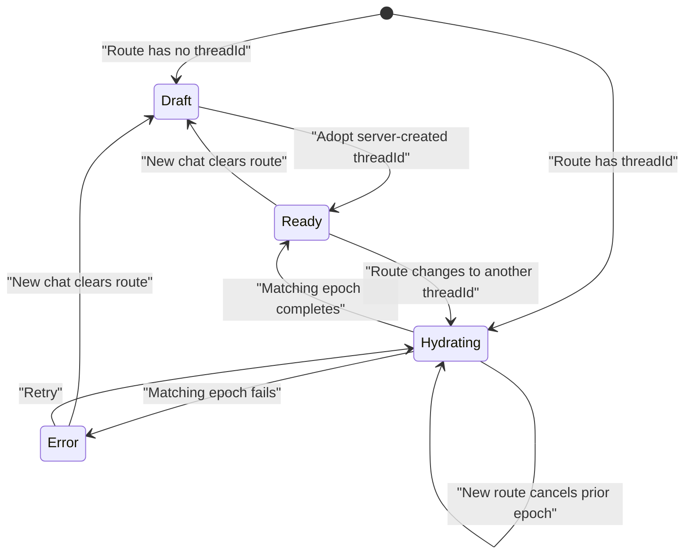
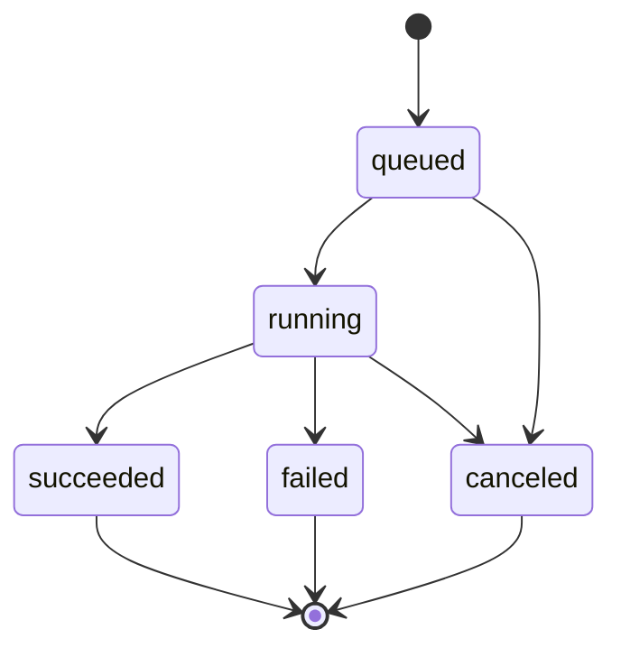

# Core Reliability Replumbing Specification

- **Status:** Proposed
- **Audience:** Senior engineer taking over core reliability work
- **Last updated:** July 24, 2026
- **Code baseline:** `main` at `c63e151`
  (`fix: make reloaded chat actions and Stop durable (#659)`)

## Executive summary

Comparative does not need a ground-up product rewrite. It does need a focused
replumbing of the state boundaries underneath the chat experience.

The recurring production failures share two causes:

1. More than one layer believes it owns the same state. Examples include the
   URL and local tab state disagreeing about the active thread, or the run
   record and persisted assistant message disagreeing about whether a turn was
   canceled.
2. The current automated harness proves components and mocked flows, but does
   not consistently prove the assembled, authenticated production experience.

This plan keeps the existing Next.js application, data model, Bedrock/provider
seam, artifact version model, and most UI components. It replaces ambiguous
ownership with explicit contracts, then tests those contracts at the lowest
reliable layer and again through the real browser.

The intended result is deliberately narrow:

- A URL always identifies the conversation visible on screen.
- A canceled run can never later appear as a successful assistant response.
- Every download either produces a browser-visible file or a visible error.
- Thread resources cannot leak into an unrelated thread.
- Artifact updates, copies, and new artifacts are explicit operations.
- Exact-output and date-sensitive requests are checked before they reach the
  user.
- The same foundational flows pass in unit tests, integration tests, a real
  local browser, and the deployed authenticated product.

Scheduling, recommendations, and other aspirational features should remain
outside the promotion gate until this foundation is consistently green.

## Why this work is necessary

The deployed regression run `CBX-20260724-222614` was executed against
production SHA `c63e1512ecbef5c26cd9080964e4c7def23371a8`. Under strict,
observable-UI grading it produced:

- **4 passed**
- **9 failed**
- **1 blocked**

The important result was not simply the score. Several failures occurred after
their implementation PRs and automated checks had passed. That means the
current harness has false confidence at the exact boundary customers use.

### Production findings

| Area | Result | Tracking |
| --- | --- | --- |
| CSV attachment and grounding | Attachment, grounded answer, and follow-up passed. The larger journey failed on stale-route reload, not CSV parsing. The targeted duplicate-attachment regression also passed this run. | [#650](https://github.com/DadJokez/AI-workspace/issues/650), [#664](https://github.com/DadJokez/AI-workspace/issues/664) |
| Artifact create and preview | Creation, preview, and content generation passed. The journey later failed on revision identity and stale-route reload. | [#642](https://github.com/DadJokez/AI-workspace/issues/642), [#664](https://github.com/DadJokez/AI-workspace/issues/664) |
| Update existing artifact without copying | Failed; “do not make a copy” was classified as copy intent | [#642](https://github.com/DadJokez/AI-workspace/issues/642) |
| Transcript export | Failed to produce an observable file after reload | [#653](https://github.com/DadJokez/AI-workspace/issues/653) |
| Thread isolation | Failed; a prior thread's app recommendation appeared in a new thread | [#643](https://github.com/DadJokez/AI-workspace/issues/643) |
| Relative dates and memory | Failed; an invented wrong date was proposed as durable user memory | [#646](https://github.com/DadJokez/AI-workspace/issues/646) |
| Settings modal | Failed accessibility/interaction assertions | [#648](https://github.com/DadJokez/AI-workspace/issues/648) |
| Exact-output instruction | Canonical output shapes passed; the compound “remember X, then reply exactly ACK” contract failed | [#652](https://github.com/DadJokez/AI-workspace/issues/652) |
| Stop/cancel durability | Failed after reload | [#655](https://github.com/DadJokez/AI-workspace/issues/655) |
| Edit after reload | Passed | [#656](https://github.com/DadJokez/AI-workspace/issues/656) |
| New-chat URL durability | Failed; stale `threadId` restored the prior chat on reload | [#664](https://github.com/DadJokez/AI-workspace/issues/664) |

The baseline run also passed the targeted regressions for
[#645](https://github.com/DadJokez/AI-workspace/issues/645),
[#647](https://github.com/DadJokez/AI-workspace/issues/647),
[#650](https://github.com/DadJokez/AI-workspace/issues/650), and
[#656](https://github.com/DadJokez/AI-workspace/issues/656). Those passing
behaviors must be retained as permanent regressions.

## Goals

1. Establish one canonical owner for conversation, run, resource, artifact, and
   output state.
2. Make state transitions explicit, typed, and reject invalid transitions.
3. Move correctness checks out of prompt prose where deterministic code can
   enforce them.
4. Build a layered harness that distinguishes product regressions from model
   variance, test-fixture failures, deployment lag, and authentication failures.
5. Make production canary failures reproducible locally and actionable from
   preserved evidence.
6. Ship this work as reviewable, independently reversible PRs.

## Non-goals

- Rewriting the entire chat application.
- Replacing the current model provider or agent runtime.
- Redesigning the product or introducing a new design system.
- Adding scheduling, proactive recommendations, or new agent capabilities.
- Introducing a new production dependency as part of the initial work.
- Requiring a database migration for the first correctness fixes.
- Treating model-generated prose as the source of truth for successful product
  actions.

Any new dependency, schema migration, authentication change, secret, or
permission change requires Rob's explicit approval before implementation.

## Core design rule

For every important customer-visible fact, exactly one system owns the
canonical value. Every other representation is derived from or reconciled to
that value.

| Fact | Canonical owner | Derived representations |
| --- | --- | --- |
| Active persisted conversation | Route `threadId` | Hydrated messages, sidebar selection, local view model |
| Unsaved new conversation | Explicit draft state | Empty composer view |
| Run status | Server-side run state machine | Stop button state, progress UI, reload result |
| Durable assistant result | Atomic successful run finalization | Hydrated transcript, artifact references |
| Files available to the turn | Server-built turn resource manifest | Prompt context, attachment chips |
| Artifact operation | Typed server-side artifact command | New version, copy, or new artifact |
| Exact response shape | Parsed output contract | Stream/buffer policy and validator |
| Relative-date meaning | Deterministic temporal context | Model prompt and response validator |
| Download success | Browser-observed response and file | Success UI |

## Required invariants

These are product contracts, not suggestions for model behavior.

### Conversation invariants

- If the UI shows persisted thread `T`, the URL contains `threadId=T`.
- If the URL contains `threadId=T`, the UI is either loading `T`, showing `T`,
  or showing an explicit not-found/error state. It must never silently show a
  different thread.
- “New chat” immediately removes the prior `threadId` from the route.
- The first successful send in a draft chat replaces the route with the server's
  canonical thread ID.
- Created-thread adoption is atomic from the controller's perspective: the
  session ID and route converge before another send is accepted.
- A late response from an older hydration request cannot overwrite a newer
  route.
- Reloading the page restores the same visible conversation and available
  actions.
- Browser Back and Forward hydrate the conversation named by the resulting
  route.
- Navigating away from a running turn detaches its UI stream without
  durably canceling the server run. Reopening the thread shows the eventual
  result.
- Explicit New chat clears unsent text and attachments. Ordinary draft reload
  continues to follow the existing draft-restoration policy.
- An invalid, unauthorized, or deleted `threadId` never falls through to a
  different conversation.

### Run invariants

- Allowed persisted states remain `queued`, `running`, `succeeded`, `failed`,
  and `canceled`.
- `succeeded`, `failed`, and `canceled` are terminal and immutable.
- A run cannot be both canceled and associated with a visible successful
  assistant message.
- Cancellation and successful finalization serialize on the same database row
  or compare-and-set condition.
- The Stop action is considered successful only after the database has
  atomically reached terminal `canceled`. Provider termination may complete
  asynchronously and cannot weaken that persistence barrier.
- After Stop reports success, reload cannot reveal additional output from that
  run.
- A canceled run cannot commit downstream side effects such as artifacts,
  memory proposals, or app recommendations.
- Repeated cancellation is idempotent and returns the authoritative terminal
  outcome.

### Resource and thread-isolation invariants

- Current-turn attachments may be selected automatically. Older thread
  resources require an explicit filename/reference, selected UI object, or
  unambiguous continuation.
- Account-level app metadata is routing data, not automatically prompt-visible
  conversation context.
- Apps, including current-thread apps, require app intent before they become
  model-visible.
- Cross-thread resources require an explicit user request or exact
  user-selected resource identity.
- IDs, timestamps, CBX run labels, and other high-frequency synthetic tokens
  cannot create semantic app matches.
- The server records enough provenance to explain why every resource entered a
  turn.

### Artifact invariants

- Every artifact mutation resolves to exactly one of `create`, `update`, or
  `copy`; view, open, show, and download requests resolve to no mutation.
- Updating an existing named artifact creates a new revision in the same
  artifact group by default.
- Copying requires affirmative copy intent.
- Negated phrases such as “do not copy,” “don't duplicate,” and “same artifact”
  cannot resolve to `copy`.
- UI-supplied artifact IDs are locators, not authorization. The server
  re-authorizes ownership and revision scope before mutation.
- Concurrent updates cannot silently revise a stale head.
- Downloading an artifact either creates a browser-observable file with a valid
  filename and non-empty body, or displays an error.

### Output and temporal invariants

- A literal exact-output request is not delegated to a generative model when the
  literal can be returned directly.
- Counted lists, schemas, and format-constrained responses are validated before
  they are shown.
- Strict output emits no answer text and persists no assistant output until the
  contract validates.
- A relative date is resolved against an explicit timezone and local date
  anchor.
- The product does not invent a calendar date when deterministic resolution is
  unavailable.
- The assistant acknowledges a durable memory write only after the system has
  accepted that write; background inference must not be described as completed.

## Current failure mechanisms

File references in this section are landmarks against the baseline SHA. They
may move during implementation.

### 1. Conversation identity has multiple owners

The `/chat` page reads `threadId` on the server in
`apps/web/app/chat/page.tsx`, but the client then owns a separate
`ChatTab[] + activeId` state in `apps/web/app/chat/use-chat-tabs.ts`.
`initialThreadId` is applied once during initialization.

New chat, sidebar selection, command-palette selection, and active-tab deletion
primarily mutate local state. They do not all perform canonical navigation.
When the server creates a thread on first send, the SSE metadata contains the
new ID, but the client patches the local tab rather than replacing the route.

This directly explains [#664](https://github.com/DadJokez/AI-workspace/issues/664):

1. Open thread A at `/chat?threadId=A`.
2. Select New chat.
3. Send a message and create thread B.
4. The React view shows B while the URL still says A.
5. Reload restores A.

The current browser tests often hide this because they do not assert the URL,
do not reload the same URL, or discover a thread through the API and construct
the correct URL themselves.

### 2. Cancellation and success can race

The current Stop path waits for the run ID, calls the cancel endpoint, then
aborts the browser stream after a successful response. That is directionally
correct.

The remaining race is on the server:

- `cancelRun` reads the status and later updates the run.
- Assistant persistence locks the run and inserts the assistant result while
  the run may still be marked `running`.
- Terminal success is recorded later.
- Cancellation can therefore read `running`, wait, then overwrite the run as
  `canceled` after an assistant message has been committed.
- Hydration trusts the persisted assistant message, so reload exposes the result
  of a supposedly canceled run.

The browser test currently mocks both chat streaming and the cancel endpoint, so
it proves client wiring without exercising this database race.

### 3. Export success is inferred rather than observed

Persisted-thread export is rendered as a link to the export API. The endpoint
does authentication and returns a Markdown attachment, but the client has no
explicit status, content-type, content-disposition, body, or browser-download
verification. A rejected or malformed response can look like a no-op.

The unit tests mock authentication and the database. Feature-level browser
tests broadly intercept `/api/**`. The existing production-auth smoke proves
valuable signed-in API/database/runtime behavior, while public production smoke
checks public surfaces; neither currently proves an authenticated browser
receives a file.

### 4. Artifact copy intent is substring-based

`apps/web/lib/artifact-context.ts` contains separate-artifact intent patterns
that match “make a copy.” The text “do not make a copy” still contains that
affirmative substring and resolves to separate-artifact mode.

`apps/web/lib/artifact-revisions.ts` then correctly executes the incorrect
classification and creates a `-copy` artifact. This is a deterministic parser
bug. More prompting will not make it reliable.

### 5. Account routing context leaks into turn context

Durable conversation files are mostly thread-scoped. The observed leak in
[#643](https://github.com/DadJokez/AI-workspace/issues/643) comes from the app
recommendation path:

- The account capability graph loads apps across the account.
- `sourceThreadId` exists in storage but is not preserved through the active
  capability representation.
- The graph and app list are injected into ordinary turns.
- App matching allows weak token overlap.
- Similar run IDs and timestamps can make a prior app appear relevant.

The system is therefore honoring account-level retrieval rules where the user
expects thread-level isolation.

### 6. Exact output is a prompt hint

`buildExactOutputContract` currently adds general prompt guidance. The stream is
not governed by a parsed literal, list-count, schema, or code-block contract,
and the persisted output is not validated against one.

The special case “remember this, then reply exactly ACK” is also internally
conflicted: memory capture is queued after the response, so the model is asked
to acknowledge a write it cannot truthfully observe.

### 7. Relative dates are not deterministically resolved

The timezone is transported into the agent loop, but relative weekdays and
calendar references are still left to generation. There is no deterministic
resolver or output validator between model output and persistence.

This is separate from memory provenance. The current user-evidence memory
hardening should remain intact while temporal resolution is added.

### 8. Test doubles end before the riskiest boundaries

The current suite has useful unit coverage, mocked Playwright flows, and a local
core pipeline with a deterministic agent. However:

- Mocked browser tests cannot expose database ordering races.
- Local deterministic-agent tests cannot expose real-model contract failures.
- API-level tests cannot prove that the browser downloaded a file.
- Public production smoke cannot prove authenticated chat behavior.
- Several Playwright feature suites skip against an external base URL.
- Some tests normalize stale URLs instead of asserting navigation behavior.

The harness must intentionally cross each of those boundaries.

## Target architecture

### A. Route-owned active conversation

Introduce one small conversation controller or reducer with explicit states:

```ts
type ActiveConversation =
  | { kind: "draft"; sessionKey: string }
  | { kind: "hydrating"; threadId: string; sessionKey: string; epoch: number }
  | { kind: "ready"; threadId: string; sessionKey: string; epoch: number }
  | {
      kind: "error";
      threadId: string;
      sessionKey: string;
      epoch: number;
      reason: string;
    };
```

The route owns persisted identity. The controller owns only transition state
needed to render and reject stale work. Replace the current one-shot
`initialThreadId` consumption with a reactive route source such as
`useSearchParams`, a route key, or an equivalent keyed controller. Calling
`router.push` or `router.replace` without making hydration reactive is not
sufficient.



All entry points must invoke one navigation command:

- `newConversation()`
- `openConversation(threadId)`
- `adoptCreatedConversation(threadId)`
- `deleteActiveConversation()`

These commands update the URL and let route-driven hydration update the view.
They must not independently patch a second canonical thread identity.

On the first server metadata event containing a created `threadId`, use
`router.replace` so the draft becomes reload-safe without adding a misleading
empty-draft history entry. Because navigation is asynchronous, created-thread
adoption must also update the controller's derived session identity in the same
transition and temporarily reject another submit until
`routeThreadId === sessionThreadId`. A rapid second send must use the created
thread ID; it must never create a second thread.

The visible conversation should become one `ActiveConversationView` plus an
opaque `sessionKey`, not the current single-element `ChatTab[] + activeId`
legacy array. If this removal must be staged, document the temporary invariant
and remove the redundant identity in the immediately following PR.

Submission has two milestones: server acceptance and stream completion. Expose
both instead of clearing edit or draft state optimistically or waiting for the
entire answer:

```ts
type AcceptedTurn =
  | {
      accepted: true;
      threadId: string;
      userMessageId: string;
      runId: string;
    }
  | {
      accepted: false;
      reason: "busy" | "invalid" | "network" | "canceled" | "stale-session";
    };

type SubmitHandle = {
  accepted: Promise<AcceptedTurn>;
  completed: Promise<void>;
};
```

The run identity should be available synchronously with acceptance, through a
split accept-turn response, response headers, or an equivalent protocol that
does not make early Stop wait for an SSE metadata event.

Bind destructive edits to `{ sessionKey, threadId, messageId }`. Reject a stale
edit after route/session change, retain the replacement text, and show an error.
After acceptance, reconcile the transcript from the canonical server branch and
hydration epoch rather than fuzzy content merging.

Define query-parameter behavior in the navigation helper:

- New chat clears `threadId`, `inspectRun`, and stale transient pane state.
- Open chat replaces `threadId` and clears a run inspector that does not belong
  to that thread.
- OAuth-return parameters such as `connected` and intentional `open` state are
  consumed once, then removed or preserved according to their existing owner.
- Back/Forward applies the same policy through reactive route reconciliation.

Deleting the active thread replaces the route with `/chat`. Returning to the
deleted URL shows an explicit not-found state. Deleting a non-active thread does
not change the route.

### B. Serialized run lifecycle

Keep the existing persisted status vocabulary, but enforce transitions in one
run service.



Required implementation properties:

1. `cancelRun` authorizes ownership and obtains the same row lock used by
   finalization inside one transaction, then re-reads the row.
2. If a durable assistant result already exists, cancellation cannot overwrite
   the run as canceled.
3. Successful assistant persistence and `status=succeeded` occur in one
   transaction.
4. Terminal updates use a conditional transition, not an unconditional
   `UPDATE ... WHERE id = ?`.
5. Terminal `canceled` in the database is the durable UI release barrier.
   Browser/provider abort is best-effort runtime cleanup, not the source of
   truth.
6. Runtime cancellation is cross-instance. A cancel request may land on a
   different ECS task, so correctness cannot depend only on an in-process
   `AbortController`. Inline and worker execution both observe database
   cancellation on a bounded cadence independent of provider event emission.
7. Artifact, memory, app, and other side-effect commits use an atomic eligibility
   condition or idempotent projection rule; a pre-commit `SELECT` by itself is
   not a fence.
8. The cancel endpoint returns an authoritative typed outcome:
   `canceled`, `already_canceled`, `already_terminal`, or `result_committed`.
   The UI only announces cancellation when the outcome is `canceled` or
   `already_canceled`; for `already_terminal` or `result_committed`, it
   reconciles the canonical run result and does not claim that cancellation
   occurred.

A useful internal API shape is:

```ts
transitionRun({
  runId,
  from: ["queued", "running"],
  to: "canceled",
  requireNoAssistantResult: true,
});
```

The exact SQL can use a row lock or compare-and-set update. The invariant is
more important than the helper name.

For the no-migration implementation, define successful finalization narrowly
and precisely:

1. Lock an eligible `running` run.
2. Insert the durable assistant message.
3. Store `outputs.assistantMessageId`.
4. Set `status=succeeded`.
5. Append the existing run-completed event/metadata.
6. Commit all five steps atomically.

Hydration can only expose that committed assistant message. Artifact, app, and
memory work that remains outside the transaction is an idempotent projection
allowed only from `succeeded`; if an artifact is part of the assistant's core
successful result, its required database writes belong inside finalization.

Existing inconsistent rows need read-side containment: hydration and export
must not expose an `assistantMessageId` owned by a canceled run. Add a one-off
read-only audit that counts these legacy inconsistencies before rollout.

Without a migration, exactly one assistant message per run is enforced by the
run-row lock and application transaction. A future
`chat_messages.run_id UNIQUE`/foreign-key hardening can be proposed separately
if the audit or load tests justify it.

### C. Explicit download transaction

Replace fire-and-forget navigation with a browser-observed export operation:

1. Start the request from an explicit button action.
2. Show a pending state.
3. Verify a 2xx response.
4. Reject redirects and login/error HTML.
5. Verify the expected content type and parse `filename` or `filename*` from
   `Content-Disposition`.
6. Sanitize the filename, enforce the expected extension, and apply a bounded
   response-size policy.
7. Verify a non-empty body.
8. Create and click a browser download with the sanitized explicit filename.
9. Announce only that a validated response was received and a download was
   initiated.
10. Display an actionable inline error on any failure.

Page JavaScript cannot prove that the operating system completed the save. The
e2e assertion must observe Playwright's `download` event and inspect the
suggested filename and saved non-empty body. A 200 API response alone is
insufficient. The real seeded-auth browser test must leave the export route
unmocked.

### D. Typed artifact operations

Replace mutually overlapping regex modes with a mutation-gated plan:

```ts
type ArtifactMutation =
  | { kind: "create"; requestedName?: string }
  | {
      kind: "update";
      targetArtifactId: string;
      expectedHeadRevision: number;
    }
  | {
      kind: "copy";
      targetArtifactId: string;
      requestedName?: string;
    };

type ArtifactMutationPlan =
  | { kind: "none" }
  | { kind: "mutate"; operations: ArtifactMutation[] };
```

Resolution order:

1. Read mutation intent only from the current user turn. Do not inherit copy or
   update language from prior context.
2. Require affirmative mutation intent. Show, open, preview, and download
   requests resolve to `none`.
3. Identify an explicit artifact target by authorized selected UI object,
   server-owned ID, or name unambiguous within the current thread/artifact
   scope.
4. Detect and mask negated action spans.
5. Resolve affirmative copy/duplicate/fork language to `copy`.
6. Resolve edit/update/revise language for a target to `update`.
7. If affirmative mutation intent and a single target exist, but no affirmative
   copy intent exists, default to `update`.
8. Otherwise resolve to `create` or return a clarification for ambiguity.

The plan is per assistant response and contains one operation per emitted
artifact. Multi-file or companion-file generation must therefore declare which
files revise existing artifacts and which create new ones. The executor:

- re-authorizes every target ID against the current account and allowed scope;
- rejects ambiguous duplicate names;
- compares `expectedHeadRevision` for updates and rejects/reconciles a stale
  head rather than silently branching;
- executes each operation exactly once under the run's idempotency key; and
- returns explicit artifact IDs and revisions for persistence and hydration.

The existing artifact group, version, and supersedes fields can implement the
initial version without a schema migration.

### E. Turn resource manifest

Build one server-side manifest for each turn before agent execution:

```ts
type TurnResourceManifest = {
  threadId: string;
  turnId: string;
  matcherVersion: string;
  selected: Array<{
    resourceId: string;
    sourceThreadId: string;
    kind: string;
    selectionReason:
      | "current-turn"
      | "explicit-filename"
      | "selected-ui-object"
      | "unambiguous-continuation"
      | "explicit-account-selection";
    authorizationScope: "thread" | "account";
  }>;
  rejected: Array<{
    resourceId: string;
    reason:
      | "wrong-thread"
      | "no-explicit-reference"
      | "no-app-intent"
      | "ambiguous-name"
      | "unauthorized"
      | "identifier-only-match";
  }>;
};
```

Rules:

- Current-turn attachments are eligible by default.
- Older current-thread resources require explicit reference, selected UI state,
  or an unambiguous continuation. They are candidates, not automatically
  injected context.
- Apps require app intent even when they originated in the current thread.
- Account-wide objects stay in a routing candidate index and are not
  model-visible by default.
- Exact app name/slug or an explicit library/app request can promote an
  account-wide object into the manifest only after ownership authorization.
- Duplicate exact names require clarification or a user selection.
- Generic IDs, UUID fragments, timestamps, and digit-heavy tokens are removed
  from semantic matching.
- The manifest records selected resources and rejected candidates so a failed
  canary can answer both “what context entered this turn?” and “why was another
  candidate excluded?”

If recording the complete manifest requires a schema change, first emit it to
structured logs or existing run metadata. Treat a new table/column as a
separate approval item.

### F. Executable output contracts

Parse high-confidence instructions into typed contracts before generation:

```ts
type OutputContract =
  | {
      kind: "literal";
      value: string;
      normalization: "byte-exact" | "normalize-final-newline";
    }
  | {
      kind: "list";
      count: number;
      marker: "bullet" | "numbered";
      surroundingProse: "forbidden" | "allowed";
      ordered: boolean;
    }
  | {
      kind: "json";
      schema: SupportedJsonSchema;
      surroundingProse: "forbidden";
    }
  | {
      kind: "code";
      language?: string;
      fenceRequired: boolean;
      surroundingProse: "forbidden" | "allowed";
      exactBody?: string;
    }
  | { kind: "unconstrained" };
```

Execution policy:

- Return literal contracts directly when no model reasoning is needed.
- Define Unicode, whitespace, and final-newline normalization in the contract;
  never normalize implicitly after grading.
- Support a dependency-free JSON-schema subset initially: object, array,
  string, number, integer, boolean, null, required properties, enums, and
  bounded array lengths. A broader validator dependency requires separate
  approval.
- Buffer strict structured output rather than exposing invalid partial output.
- Emit no answer deltas and persist no assistant message until validation
  succeeds.
- Validate before persistence.
- Retry once with validation errors when generation is necessary, using the
  same side-effect idempotency key so the retry cannot duplicate writes.
- Record failed attempts without erasing the first-attempt result.
- If validation still fails, persist/emit a typed visible contract failure
  rather than silently violating the instruction.

For explicit memory writes, use a synchronous domain action and name its state:
`proposed`, `system_accepted`, `user_approved`, or `durable`. The assistant may
acknowledge only the state actually reached. An accepted Vault proposal is not
described as “remembered” if user approval or a durable write is still pending.
Implicit memory inference can remain asynchronous.

### G. Deterministic temporal context

Create a temporal context at request start:

```ts
type TemporalContext = {
  timezone: string;
  timezoneSource: "current-turn" | "user-profile" | "browser" | "unresolved";
  resolvedAt: string;
  localDate: string;
  localDateTime: string;
  resolvedReferences: Array<{
    sourceText: string;
    isoDate: string;
  }>;
};
```

Capture one fixed `resolvedAt` clock at request acceptance. Timezone precedence
is an explicit timezone in the current turn, then the saved user timezone, then
the trusted browser/request timezone. Accept valid IANA zones only. If none is
valid, leave the expression unresolved and preserve the relative wording or ask
for clarification; do not silently invent a UTC interpretation.

Initial weekday semantics:

- `today` is the local date at `resolvedAt`.
- `tomorrow` is the following local calendar date.
- `this <weekday>` is that weekday in the current ISO week. If it has already
  passed and the request is future-oriented, ask for clarification.
- `next <weekday>` is that weekday in the following ISO week, including when
  today already has that weekday.
- A bare weekday means the nearest occurrence on or after today.
- Ambiguous phrases such as “next weekend” remain relative or trigger
  clarification until explicitly specified.

Use calendar arithmetic in the selected zone across daylight-saving,
month-end, and year-end boundaries. Ambiguous/nonexistent local clock times
must be clarified or use a separately documented disambiguation policy.

Provide both the original phrase and resolved value to the agent. Validate only
calendar dates causally tied to parsed relative references; do not reject
unrelated dates quoted from CSVs, artifacts, or source documents.

The evaluator and production runtime must use the same model configuration when
the test intends to measure model behavior. Deterministic date resolution
should still pass independently of model choice. Behavioral evals must import
the production model resolver rather than carrying a separate default (the
baseline date eval and production had drifted between Sonnet 4.5 and 4.6), and
must record the resolved provider/model IDs.

### H. Accessible modal behavior

Treat Settings as an independent, small UI repair:

- One unambiguous accessible close action.
- `role="dialog"` with an accessible name.
- Initial focus inside the modal.
- Focus trapped while open.
- Escape closes it.
- Background content is inert/non-interactive.
- Closing restores focus to the opener.
- Mobile and desktop paths share the same behavior.

## Implementation sequence

Each phase should be a focused PR. Do not combine these into one large branch.
Later phases may begin in parallel only when they do not depend on an unsettled
contract.

### PR 1 — Establish minimal contract IDs and the run-race harness

**Purpose:** Make the first high-severity fix measurable without delaying it
behind a reporting-framework rewrite.

**Work:**

- Give every case a stable ID shared across unit, integration, browser, and
  production reports, starting with Stop/finalization.
- Add a deterministic real-Postgres concurrency harness that can pause between
  assistant insertion and the current terminal run update.
- Add a minimal machine-readable result envelope; extend it incrementally in
  each later PR and finalize reporting in PR 10.
- Define failure classes: product, model-contract, fixture, auth, deployment,
  and harness.
- Preserve the existing passing regressions.

**Exit criteria:**

- Known baseline failures are represented by `test.fails`, an explicit
  known-failure manifest, or a non-blocking characterization report. They do
  not make the required branch red, and skipped tests do not count as
  coverage.
- A harness failure cannot be accidentally reported as a product pass or fail.
- The cancellation race is deterministic and reproducible.

### PR 2 — Close the immediate cancellation race

**Purpose:** Make the existing Stop flow safe before broader refactors.

**Work:**

- Lock, authorize, and re-read the run inside `cancelRun`.
- Reject cancel-to-canceled when a durable assistant result already exists.
- Replace unconditional terminal updates with conditional transitions.
- Return the typed authoritative outcome from the cancel endpoint.
- Suppress canceled-run assistant output during hydration and export.
- Add a read-only audit for legacy canceled/result inconsistencies.

**Required tests:**

- Deterministically interleave cancel after assistant insert but before the old
  success update; assert exactly one terminal result.
- Cancel before generation starts.
- Cancel during streaming.
- Repeated cancel returns `already_canceled`.
- Cancel after success returns `already_terminal`; cancellation was not
  performed and state is not rewritten.
- A running row with `outputs.assistantMessageId` returns `result_committed`
  rather than canceled.
- Hydration/export suppresses a legacy canceled-run assistant result.

**Exit criteria:**

- There is no new database state with `status=canceled` and a visible successful
  assistant result for that run.
- The real-Postgres test is part of the required workflow in this PR.

### PR 3 — Make finalization atomic and cancellation cross-instance

**Purpose:** Complete the run-state repair after the immediate race is closed.

**Work:**

- Persist the assistant result and terminal success using the exact atomic
  boundary defined above.
- Expose run identity at turn acceptance so early Stop does not wait for SSE.
- Add lane-neutral database cancellation observation for inline and worker
  execution; an in-process abort registry may be an optimization only.
- Fence or make idempotent every post-terminal projection.
- Add structured transition logs with run ID and previous/next state.

**Required tests:**

- Real database concurrency test for cancel versus finalization.
- Inline and worker cancellation while the provider emits no events.
- Cancel request handled by a different app instance from the executor.
- Canceled turn cannot create an artifact, memory proposal, or app record.
- Stop → acknowledged canceled → reload remains canceled.
- Run terminal states remain immutable under retries.

**Exit criteria:**

- Targeted [#655](https://github.com/DadJokez/AI-workspace/issues/655) browser
  variants pass 10/10 against the real local stack.
- The real API/database Stop browser test is required in this PR, not deferred
  to the later production-gate work.

### PR 4 — Make route identity canonical

**Purpose:** Fix [#664](https://github.com/DadJokez/AI-workspace/issues/664)
and remove split ownership of the active thread.

**Work:**

- Introduce the route-driven conversation controller.
- Route all new/open/delete/adopt actions through canonical navigation.
- Replace the URL with the server-created thread ID on first-send metadata.
- Replace one-shot `initialThreadId` application with reactive route hydration.
- Add hydration epochs or abort signals.
- Split submit acceptance from stream completion and include run identity.
- Replace the legacy single-element tab array with one conversation view, or
  document and immediately remove any compatibility stage.
- Define query-parameter, invalid-route, delete, draft, and background-run
  navigation behavior.

**Required tests:**

- Deep-link A → New chat → send B → URL is B → reload still shows B.
- Deep-link A → New chat → URL no longer contains A before any send.
- First-send rejection stays on a draft `/chat`.
- Rapid second send after first metadata uses B and never creates C.
- Rapid A → B navigation cannot render a late A response.
- Sidebar, command-palette, notification, and pane thread-open actions update
  the URL.
- Browser Back/Forward hydrates the matching thread.
- Invalid/not-owned/deleted routes never render another thread.
- Explicit New clears unsent text and attachments.
- Navigation detaches a running turn without canceling it; reopening shows its
  eventual result.
- Edit-after-reload regression [#656](https://github.com/DadJokez/AI-workspace/issues/656)
  remains green.
- A stale/rejected edit retains replacement text and surfaces an error.
- Rewrite the existing e2e reload cases that currently expect an empty state or
  manually reopen the thread; assert the resulting URL and reload that URL.
- Update `/e2e/chat` to honor search parameters.
- Real `/chat` Playwright using existing test auth, deterministic provider,
  real route handlers, and real Postgres. Keep a fast mocked UI test for
  route/history races.

**Rollback:** Revert the controller and navigation commands as one PR. No data
migration is involved.

### PR 5 — Make downloads observable

**Purpose:** Fix [#653](https://github.com/DadJokez/AI-workspace/issues/653)
at the browser boundary.

**Work:**

- Implement the explicit download transaction.
- Add pending, success, and error UI.
- Sanitize server-provided filenames.
- Keep server authorization and ownership checks.

**Required tests:**

- Authorized transcript export triggers a browser download with non-empty
  Markdown.
- Authorized artifact export triggers a browser download with the correct
  filename and non-empty body.
- Seeded-auth local browser test leaves the export route unmocked.
- 401/403/404/500 and malformed content show a visible error.
- A simulated browser download failure is not reported as success.
- Deployed authenticated canary captures the download event.

**Exit criteria:**

- Export is graded on an observed file, not a clicked element or 2xx API call.

### PR 6 — Replace artifact intent regexes with operations

**Purpose:** Fix [#642](https://github.com/DadJokez/AI-workspace/issues/642)
without destabilizing version history.

**Work:**

- Add `ArtifactMutationPlan`.
- Implement the mutation activation gate, authorized target resolution, and
  negation-aware operation parsing from the current user turn.
- Route create/update/copy through one operation executor.
- Add expected-head concurrency checks and run-scoped idempotency.
- Retain existing group/version/supersedes behavior.

**Required tests:**

- “Update X” revises X.
- “Update X; do not make a copy” revises X.
- “Make a copy of X” copies X.
- “Do not duplicate X” does not copy X.
- “Show/download/open X” performs no mutation.
- Ambiguous target returns a clarification/error rather than mutating the wrong
  artifact.
- An unauthorized UI-supplied ID is rejected.
- Two updates from the same stale revision cannot silently both become the
  latest head.
- Multi-file output declares and performs one operation per file.
- Revision download still works after reload.

**Exit criteria:**

- Update and copy variants each pass 10/10 without model-dependent
  classification.

### PR 7 — Separate account routing from turn context

**Purpose:** Fix [#643](https://github.com/DadJokez/AI-workspace/issues/643)
and harden all resource scoping.

**Work:**

- Preserve `sourceThreadId` through capability graph construction.
- Introduce the turn resource manifest.
- Stop injecting all account apps into ordinary chat turns.
- Add explicit promotion rules for cross-thread/account resources.
- Ignore identifier-like tokens during app matching.
- Emit selected and rejected manifest provenance, matcher version, selection
  reason, and authorization scope in structured evidence.

**Required tests:**

- Two threads with similar CBX IDs cannot see each other's app/resource.
- A current-turn attachment is available automatically.
- An older current-thread attachment is available only through explicit
  filename/reference, selected UI state, or unambiguous continuation.
- An exact app-name request can intentionally retrieve an account app.
- A generic question cannot, and duplicate app names require selection.
- CSV upload → answer → follow-up → reload preserves only the expected current
  thread resource.

**Exit criteria:**

- Thread-isolation variants pass 10/10.
- Every injected resource has recorded provenance.

### PR 8 — Enforce output and temporal contracts

**Purpose:** Fix [#646](https://github.com/DadJokez/AI-workspace/issues/646)
and [#652](https://github.com/DadJokez/AI-workspace/issues/652).

**Work:**

- Parse and execute typed output contracts.
- Add the deterministic temporal context and resolver.
- Validate strict outputs and resolved dates before persistence.
- Add one bounded correction attempt for model-generated contracts.
- Make explicit memory acknowledgement synchronous and truthful about
  `proposed`, `system_accepted`, `user_approved`, or `durable`.
- Share the production model resolver with behavioral evals.
- Preserve the existing memory evidence/provenance protections.

**Required tests:**

- Exact literal including punctuation and casing.
- Exactly N list items.
- Valid JSON matching a supplied schema.
- Required code fence/language.
- Today/tomorrow/next weekday at timezone and DST boundaries.
- Invalid timezone and ambiguous relative-date behavior.
- Date validation ignores unrelated dates quoted from an uploaded source.
- “Remember X, reply exactly ACK” reaches the named required memory state before
  ACK.
- The production-default model passes the behavioral variants; deterministic
  contracts pass with a fake provider as well.

**Exit criteria:**

- Deterministic exact/date cases pass 100%.
- Real-model variants pass the agreed threshold without silently accepting a
  contract violation.

### PR 9 — Repair Settings interaction

**Purpose:** Close [#648](https://github.com/DadJokez/AI-workspace/issues/648)
as an isolated UI change.

**Work and tests:**

- Implement the accessible modal requirements above.
- Add keyboard-only and mobile browser coverage.
- Verify focus restoration and inert background behavior.

**Exit criteria:**

- Automated accessibility assertions and real-browser keyboard flow pass.

### PR 10 — Promote the real browser to a release gate

**Purpose:** Prevent the fixed classes of failures from returning.

**Work:**

- Add a real-stack authenticated `/chat` suite that does not intercept product
  APIs.
- Add a deployed authenticated canary after deployment and nightly.
- Run a smaller deterministic subset on every PR.
- Preserve traces, screenshots, videos, console errors, network failures, and
  downloads.
- Compare deployed SHA with the expected SHA before grading.
- Deduplicate failures against existing GitHub issues.
- Publish a compact scorecard and versioned machine-readable artifact with:
  - contract ID and layer-specific assertion ID;
  - committed variant ID and attempt number;
  - first-attempt result and final result;
  - `PASS`, `FAIL`, or `BLOCKED`;
  - failure class, expected value, and observed value;
  - deployed SHA, model/provider settings, timezone, and fixed clock;
  - account label plus thread, turn, run, artifact, and resource IDs;
  - screenshot, trace, video, console, network, and download evidence
    references.
- Preserve the first attempt when rerunning; a retry cannot erase initial
  flakiness. Exclude `BLOCKED` from both the pass numerator and denominator.
- Commit all 10 variants as versioned fixtures. Do not dynamically generate
  paraphrases during a scored run.
- Exercise inline and worker execution lanes where the contract applies.
- Add deterministic per-run setup and scoped cleanup for conversation, memory,
  app, and artifact state.

**Approval boundary:** Provisioning or changing an automated test-account
credential, secret, auth exemption, or permission requires Rob's explicit
approval. The design must not place credentials in the repository.

**Exit criteria:**

- A deployed canary can prove login, upload, chat, reload, edit, Stop, artifact
  revision, and download through the same UI a customer uses.
- Deployment lag and auth/fixture failures are reported as blocked harness
  states, not product failures.

## Test architecture

No single layer is “the eval suite.” The release signal is a ladder of tests
with clear responsibilities.

Retain the existing `pnpm smoke:prod:auth` server/API production smoke; it
already proves valuable signed-in database and runtime paths. The new deployed
browser canary complements it by observing URL behavior, controls, downloads,
and other customer-visible effects. Likewise, the current local authenticated
Playwright suite remains useful for UI behavior, but its mocked Comparative
routes do not substitute for the real API/Postgres browser layer.

| Layer | What it proves | Provider | Data/API | Browser | Trigger |
| --- | --- | --- | --- | --- | --- |
| Contract/unit | Parser and state-machine invariants | Fake/none | In-memory or isolated DB functions | No | Every PR |
| Integration | Transactions, scoping, hydration, exports | Deterministic fake | Real Postgres and real route handlers | Optional | Every PR |
| Local product browser | Assembled `/chat` behavior | Deterministic fake first | Real app APIs and Postgres; no route mocks | Real Playwright browser | Every PR |
| Behavioral model eval | Model-following where generation is truly needed | Production-default model | Controlled fixtures | API or browser as appropriate | Nightly and release candidate |
| Deployed authenticated canary | Build, deploy, auth, UI, network, browser, and download integration | Deployed model | Deployed services | Visible real browser | Post-deploy and nightly |

### Required foundational scenarios

Each scenario needs a stable case ID and variants for fresh session, reload,
slow response, and realistic naming where applicable.

1. `AUTH-001` — Sign in and reach an empty draft.
2. `NAV-001` — Create a chat, observe canonical URL, and reload it.
3. `CSV-001` — Upload the authorized synthetic CSV, ask a grounded question,
   follow up, and reload.
4. `ART-001` — Create an artifact and download it.
5. `ART-002` — Update that artifact in place and verify revision history.
6. `ART-003` — Copy that artifact only when explicitly requested.
7. `RUN-001` — Stop a slow response and prove no result or side effect appears
   after reload.
8. `EDIT-001` — Edit a persisted message after reload and verify the replacement
   turn.
9. `EXPORT-001` — Export a persisted transcript and inspect the downloaded file.
10. `ISO-001` — Prove thread/resource isolation using two similar-looking
    conversations.
11. `OUT-001` — Satisfy literal, counted-list, structured, and code output
    contracts.
12. `TIME-001` — Resolve relative dates in the user's timezone.
13. `MEM-001` — Persist explicit memory before acknowledging it.
14. `SET-001` — Open and close Settings by mouse, keyboard, and mobile viewport.

Production upload tests must continue to use only the committed synthetic
`codex-browser-canary.csv` fixture already authorized for these evals.

### Historical issue traceability

Closing an issue requires the contract in every listed layer, not merely a
passing adjacent browser journey.

| Issue | Stable contract(s) | Required layers |
| --- | --- | --- |
| [#642](https://github.com/DadJokez/AI-workspace/issues/642) — revision creates `-copy` | `ART-002`, `ART-003` | Unit parser, DB integration, local browser, deployed canary |
| [#643](https://github.com/DadJokez/AI-workspace/issues/643) — prior-thread contamination | `ISO-001` | Unit matcher, DB integration, local browser, deployed canary |
| [#645](https://github.com/DadJokez/AI-workspace/issues/645) — title collapses to follow-up | `TITLE-001` | Unit/integration, local browser |
| [#646](https://github.com/DadJokez/AI-workspace/issues/646) — invented date enters memory | `TIME-001`, `MEM-001` | Unit resolver, integration, behavioral model, deployed canary |
| [#647](https://github.com/DadJokez/AI-workspace/issues/647) — Markdown request creates artifact | `ART-004` | Unit activation gate, integration, local browser |
| [#648](https://github.com/DadJokez/AI-workspace/issues/648) — modal background interactive | `SET-001` | Component/a11y, local browser, deployed canary |
| [#650](https://github.com/DadJokez/AI-workspace/issues/650) — CSV drop/leak/duplicate | `CSV-001`, `ISO-001` | Integration, local browser, deployed canary |
| [#651](https://github.com/DadJokez/AI-workspace/issues/651) — angle brackets stripped | `RENDER-001` | Unit renderer, local browser |
| [#652](https://github.com/DadJokez/AI-workspace/issues/652) — exact-output drift | `OUT-001`, `MEM-001` | Unit contract, integration, behavioral model, deployed canary |
| [#653](https://github.com/DadJokez/AI-workspace/issues/653) — transcript download no-op | `EXPORT-001` | Route integration, local browser, deployed canary |
| [#655](https://github.com/DadJokez/AI-workspace/issues/655) — stopped work persists | `RUN-001` | State machine, DB concurrency, local browser, deployed canary |
| [#656](https://github.com/DadJokez/AI-workspace/issues/656) — edit resubmits old prompt | `EDIT-001` | Integration, local browser, deployed canary |
| [#664](https://github.com/DadJokez/AI-workspace/issues/664) — stale deep-link after New | `NAV-001` | Route unit, local browser, deployed canary |

### Assertion rules

- Grade observable product behavior, not model reasoning or internal intent.
- Do not infer download success from a click.
- Do not infer cancellation from the disappearance of the Stop button.
- Do not infer persistence until a reload proves it.
- Do not infer isolation from the absence of a filename alone; assert the
  response lacks unrelated content and inspect the turn manifest where
  available.
- Wait for the preceding turn to settle before edit or Stop assertions.
- Use unique CBX run IDs so evidence is attributable and cross-run collisions
  are detectable.
- Fail tests on uncaught page errors and relevant failed network requests.
- A fixture, auth, deployment, or harness problem is `BLOCKED`, not `PASS`.
- “Unmocked local product” means a real browser, real application route
  handlers, and real Postgres; only the model/provider boundary is replaced
  deterministically.
- Scored retries retain the first-attempt outcome and evidence.

### Fixture lifecycle and isolation

- Every run uses a unique CBX namespace across conversation titles, artifact
  names, apps, memory values, and resource labels.
- Each committed variant declares deterministic preconditions and expected
  cleanup targets.
- Setup verifies the target account has no colliding active fixture before
  grading.
- Cleanup may delete only synthetic records carrying the exact run namespace
  through an approved application-scoped janitor path. It must never use a
  broad account or database delete.
- If scoped cleanup is unavailable or fails, retain the evidence, mark the case
  `BLOCKED`, and prevent the contaminated account from contributing a score.
- Production upload cases use no local file other than the committed authorized
  synthetic CSV.
- Any automated production janitor credential, permission, or schedule is a
  separate approval item.

### Automation policy

**Every PR**

- Unit and contract tests.
- Database-backed integration tests.
- Real local `/chat` browser suite with deterministic provider behavior, real
  route handlers/Postgres, and no product API interception.
- Existing lint, typecheck, unit, build, and browser-smoke gates.

**After deployment**

- Verify the served deployment SHA first.
- Run the authenticated foundational canary.
- Block promotion for a deterministic foundational failure.

**Nightly**

- Run the foundational canary with the production-default model.
- Run 10 variants for historically flaky foundational capabilities.
- Run lower-priority aspirational evals separately so they cannot obscure a
  core regression.

### Promotion criteria

The core is considered stable enough to resume aspirational feature work only
when all of the following are true:

- Deterministic PR contracts pass 100%.
- Every foundational deployed scenario passes 10/10 variants.
- Three consecutive deployed/nightly runs are clean.
- There are no critical partial grades.
- Every failure produces sufficient evidence to reproduce or classify it.

## Observability and evidence

Every chat run used by the harness should make the following fields joinable:

- deployment SHA;
- environment and base URL;
- case/variant/CBX run ID;
- account ID or opaque test-account label;
- thread ID;
- turn/message IDs;
- run ID and state-transition history;
- model and provider;
- turn resource manifest or manifest digest;
- artifact ID, group ID, and revision when applicable;
- output-contract and temporal-context kinds;
- request/response error classification.

Sensitive values and file contents must not be written to logs. IDs and
provenance are sufficient.

Evidence retention for browser failures should include:

- screenshot at the assertion boundary;
- Playwright trace and video;
- browser console errors;
- relevant failed request metadata;
- final URL;
- observed download filename and a checksum/size, not sensitive file contents;
- machine-readable assertion result.

## Rollout and rollback

1. Land contract tests first and mark known baseline failures explicitly.
2. Ship each ownership fix behind its focused PR, without a broad feature flag
   unless rollout risk requires one.
3. Validate locally with deterministic tests.
4. Deploy to the normal production path.
5. Verify the exact deployed SHA.
6. Run the targeted deployed canary.
7. Expand to the full foundational canary.
8. Keep the old implementation easy to revert until the new path has completed
   three clean nightly runs.

Do not use a passing unit suite to waive a failing deployed canary. If a canary
is blocked by its own fixture or credentials, fix the harness and rerun before
promotion.

## Risks

| Risk | Mitigation |
| --- | --- |
| Route refactor breaks browser history, draft clearing, or detached background runs | Test Back/Forward, explicit-New draft reset, rapid navigation, multiple browser tabs, and reopen-after-background-completion |
| Atomic finalization increases transaction duration | Keep provider generation outside the transaction; transaction contains only eligibility check, required result writes, terminal status, and completion metadata |
| Cancellation cannot interrupt every provider immediately | Make terminal persistence safe first; cancellation latency is secondary to preventing post-cancel commits |
| Resource scoping reduces useful cross-thread recommendations | Require explicit cross-thread intent, then measure intentional retrieval separately |
| Strict output buffering reduces streaming feel | Buffer only contracts that cannot tolerate partial invalid output |
| Date validator rejects legitimate prose | Validate only high-confidence resolved references; otherwise preserve relative wording |
| Production canaries become flaky | Separate product, model, auth, deployment, and harness classifications; use deterministic PR gates and repeated nightly behavioral variants |
| Engineer starts with a schema redesign | Deliver row-lock/CAS and existing metadata solutions first; propose migrations separately with measured need |

## Decisions for the implementing engineer

The engineer should document these choices before the corresponding PR:

1. **Conversation controller migration:** remove the hidden single-element
   `ChatTab[] + activeId` representation in PR 4, or use a tightly bounded
   compatibility stage with an explicit removal commit.
2. **Run serialization mechanism:** row lock, compare-and-set update, or both.
   The chosen mechanism must make the invariant demonstrable in a concurrency
   test.
3. **Runtime cancellation observation:** polling cadence and abort mechanism for
   inline and worker lanes after the database has committed terminal canceled.
4. **Manifest retention:** existing run metadata/structured logs first versus a
   separately approved schema addition.
5. **Strict-output streaming:** which contract types buffer completely and
   which can validate incrementally.
6. **Production test authentication:** reuse an approved canary account through
   the existing secret store or propose a scoped alternative. No repository
   credentials.

These are implementation choices, not reasons to relax the invariants.

## Definition of done

This replumbing effort is complete when:

- The ownership table in this document matches the implemented architecture.
- All required invariants have deterministic tests.
- Known issue regressions pass through the real, unmocked local product.
- The deployed authenticated suite proves the same workflows.
- Foundational scenarios pass 10/10 variants for three consecutive runs.
- The passing regressions from the baseline remain green.
- Existing relevant GitHub issues are closed with linked evidence.
- Operational documentation explains how to run, interpret, and troubleshoot
  the suite.
- No unapproved dependency, migration, credential, permission, or auth change
  was introduced.

## Related repository documents

- [Core Eval Program](./CORE_EVAL_PROGRAM.md)
- [Regression Gauntlet](./REGRESSION_GAUNTLET.md)
- [Artifact Revisions](./ARTIFACT_REVISIONS.md)
- [Runs Decision](./RUNS_DECISION.md)
- [Comparative Architecture Overview](./COMPARATIVE_ARCHITECTURE_OVERVIEW.md)
- [AI PR Review Pipeline](./AI_PR_REVIEW_PIPELINE.md)
