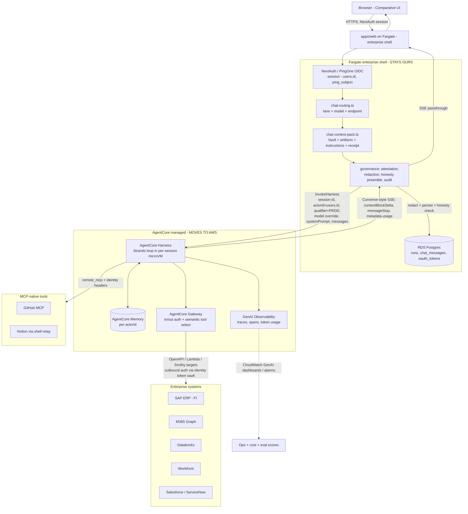

# 02 — Target Architecture on AgentCore Harness

> How Comparative looks once the agent loop is the **managed AgentCore Harness** instead of our
> hand-rolled loop (in-process Bedrock) and our custom-code AgentCore *Runtime* container.

## Assumptions

- **Three-way convergence** is the goal: the in-process Bedrock loop + the custom-code Runtime
  worker both collapse onto the managed Harness, reached through the existing `AgentRuntime` seam
  ([packages/agent-runtime/src/factory.ts](../../packages/agent-runtime/src/factory.ts)).
- Enterprise IdP = **PingOne / PingFederate OIDC**; Bedrock-native model billing is the default
  (Claude-Platform-on-AWS is weighed in [05-adr/002](05-adr/002-bedrock-vs-claude-platform.md)).
- Region `us-east-1`, single account today; a dedicated AgentCore account is an open question.
- AgentCore facts below are doc-sourced (GA docs fetched 2026-06-18). **Discrepancy flagged:** the
  blog writes `awsSkills: {}` as a top-level toggle, but `CreateHarness` exposes skills only as
  `skills[]` of `HarnessSkill` union objects whose source is `awsSkills | git | s3 | path`. All
  examples here use the API shape `"skills":[{ "awsSkills": {} }]`. Verify in console before build.

## Reference: what the managed Harness gives us (doc-sourced)

- **Two calls:** `CreateHarness` (control plane `bedrock-agentcore-control`) declares model + tools +
  skills + memory + limits; `InvokeHarness` (data plane) runs it. `UpdateHarness` mints an immutable
  version. CLI `agentcore export harness` → Strands code when config isn't enough.
- **Managed loop, per-session microVM**, own filesystem + shell, short/long-term memory across
  sessions, **mid-session model switch** without losing context, tools via Gateway / remote MCP /
  built-in browser / code-interpreter / web-search, **skills** from awsSkills/git/S3, bring-your-own
  container, S3/EFS mounts, automatic tracing, evals + optimization + A/B, immutable versions + named
  endpoints, Step Functions `InvokeHarness` state. Powered by Strands.
- **Invoke surface:** session via header `X-Amzn-Bedrock-AgentCore-Runtime-Session-Id`; endpoint via
  `qualifier` query param (omit ⇒ `DEFAULT`); memory scope via `actorId`; `model`/`tools`/`skills`/
  `systemPrompt`/`allowedTools`/limits **overridable per-invocation**. Response is a Converse-style
  event stream (`contentBlockDelta/Start/Stop`, `messageStart/Stop`, `metadata.usage`).
- **Harness vs Runtime:** Harness = managed loop (config). It runs *inside* Runtime; CloudTrail under
  `AWS::BedrockAgentCore::Runtime`. Harness can't do custom frameworks, bidirectional streaming,
  graph/workflow (non-loop) patterns, or hooks → those force export-to-Strands-on-Runtime.

## 1. Service boundary

| Component | Today | Target | Why |
|---|---|---|---|
| **Next.js UI** (`apps/web` client) | in `apps/web` | **unchanged** | SSE rendering, chat UX, admin, `/skills`, `/apps` are product, not runtime |
| **Auth / session** (NextAuth, PingOne) | `apps/web` | **stays in Fargate** ("enterprise shell") | the app owns identity; Harness is invoked *on behalf of* an authenticated principal |
| **Routing policy** (lane selection) | `chat-routing.ts` | **stays in Fargate** | maps a turn → which harness/endpoint + which model; Comparative-specific |
| **Context-pack assembly** (Vault, artifacts, instructions, receipt) | `chat-context-pack.ts` | **stays in Fargate**, fed into Harness as `systemPrompt[]` + messages | product knowledge model; Harness has no opinion on it |
| **Governance** (attestation, redaction, honesty preamble, audit) | `apps/web/lib/*` | **stays in Fargate** (pre/post Harness) | the trust spine; must remain ours and inspectable for IT review |
| **Run ledger / memory tables** (`runs`, `chat_messages`, Vault) | RDS | **stays in RDS**; Harness Memory used in addition (see §6) | system-of-record for audit + sharing + RBAC; AgentCore Memory is a per-session accelerator |
| **The agent loop** (`runAgentLoop`) | `packages/agent` + container | **→ AgentCore Harness** (config) | the whole point: stop maintaining loop, tool-dispatch, truncation, streaming, session infra |
| **Tool execution** (MCP per-user) | in-process MCP client | **→ Gateway targets + `remote_mcp`** | Gateway gives managed in/out auth, semantic tool selection, audit (see §4) |
| **Model selection** | autopilot heuristic | **stays as router input → Harness `model` per-invocation** | keep our cheap-ops routing; Harness executes the switch, even mid-session |
| **AgentCore Runtime container** (`apps/agentcore-agent`) | hosts the loop | **retired** once Harness covers durable lanes; kept only as the **export-to-Strands landing zone** | Harness supersedes the custom container for the common case |

**Net:** Fargate shrinks to a **thin enterprise-shell tier** — auth, routing, context assembly,
governance, persistence, and the SSE proxy — and **stops hosting an agent loop at all**. The loop,
its infra (microVM, sessions, scaling, truncation, tool dispatch), and tool auth move to managed AWS.

## 2. Data flow (mermaid)

Identity & observability propagation, explicitly:
- **Identity:** `users.id` (canonical UUID, derived from the PingOne `sub` in `users.ping_subject`)
  → `actorId` on `InvokeHarness` (memory scope) **and** the basis for which Gateway target scopes /
  Identity-vault credentials the agent may use. Raw connector tokens never reach the model.
- **Observability:** Harness traces every step to GenAI Observability; the shell correlates by passing
  the `runs.id` as the session id / a trace attribute, so a `runs` row joins to its Harness trace.

## 3. Identity model (PingOne → AgentCore Identity actor, on-behalf-of)

1. **Human sign-in:** user authenticates to the shell via **PingOne / PingFederate OIDC** (NextAuth
   provider swap; `sub` lands in `users.ping_subject`, already wired —
   [schema.ts:111](../../packages/db/src/schema.ts), [ARCHITECTURE.md:124](../ARCHITECTURE.md)). The
   shell mints its own session; `users.id` is the canonical principal.
2. **Inbound auth to Harness:** the shell calls `InvokeHarness` with **SigV4** from a per-harness
   task role (the shell is the trusted caller). Per-end-user identity is carried as **`actorId =
   users.id`** (memory/tenancy scope) and `X-Amzn-…-Runtime-User-Id`. (Alternative: Harness inbound
   OAuth with PingOne as the authorizer via `authorizerConfiguration` — evaluated in
   [05-adr/004](05-adr/004-identity-on-behalf-of.md); SigV4-from-shell is the recommended default
   because the shell already authenticated the human and owns the audit trail.)
3. **Tenancy isolation:** every memory read/write is keyed by `actorId`; the same UUID that
   `userScope()` uses for RDS isolation today ([scope.ts:16](../../apps/web/lib/auth/scope.ts)). One
   harness serves all users; **isolation is per-`actorId`, not per-harness**.
4. **On-behalf-of tool access (the hard part):** the agent must act as the user against SAP/M365/etc.
   **without seeing raw credentials.** Target = **AgentCore Identity token vault via Gateway outbound
   auth**: the user authorizes a connector once (OAuth dance, brokered by Identity), the vault holds
   the refresh token, and Gateway injects a freshly-minted access token per tool call scoped to that
   user. This **replaces** today's pattern of decrypting `oauth_tokens` in the web process and
   passing a bearer header ([oauth/mcp-servers.ts](../../apps/web/lib/oauth/mcp-servers.ts)). Scoped
   permissions are enforced two ways: (a) `allowedTools` per invocation (glob, e.g. only
   `@sap-erp/*` for the budget agent), and (b) Gateway target scopes tied to the actor.
5. **Least privilege:** one **execution role per harness** (not per user); the role can call only the
   models + Gateway + Memory it needs ([specs/iam-and-execution-roles.md](specs/iam-and-execution-roles.md)).
   User-level authorization is `actorId` + `allowedTools` + Gateway scopes layered on top.

## 4. Tool catalog → AgentCore Gateway

Design rule: **stateful enterprise systems with real APIs → Gateway targets** (managed in/out auth,
semantic selection, audit). **Already-MCP-native or relay-bound tools → `remote_mcp`.** **Tiny pure
helpers → `inline_function`.** Full specs in [specs/gateway-targets.md](specs/gateway-targets.md).

| Integration | Target type | Protocol | Auth (outbound) | Scope / notes |
|---|---|---|---|---|
| **SAP ERP (FI)** | Gateway target | OpenAPI (SAP BTP) or Lambda shim | Identity vault: SAP BTP OAuth / service-principal | the "Budget Query" wedge; per-module scopes; RFC-gated |
| **M365 Graph** (mail/cal/files) | Gateway target | OpenAPI (Graph) | Identity vault: Entra delegated (per-user) | maps to existing `teams`/graph placeholders |
| **Databricks** | Gateway target | OpenAPI/Lambda | Identity vault: service-principal (M2M), `actorId` as audit tag | SQL + notebook ops; agent-authored notebooks may graduate to Runtime |
| **Workfront** | Gateway target | OpenAPI | Identity vault: per-user OAuth | roadmap |
| **Salesforce / ServiceNow** | Gateway 1-click | native | Identity vault | Gateway ships 1-click for Salesforce |
| **GitHub** | `remote_mcp` | MCP `https://api.githubcopilot.com/mcp/` | Identity vault OAuth (replaces in-process bearer) | already MCP-native; no Gateway needed |
| **Notion** | `remote_mcp` via the **shell relay**, OR Gateway HTTP passthrough | MCP relay (`/api/mcp/notion`, HMAC) | per-user OAuth | the same-origin relay is the open risk — see §10 |
| **web search** | built-in (`agentcore_web_search` when GA) or Gateway target now | — | — | first-party tool "coming soon"; Gateway-target workaround until then |
| **web fetch** | built-in or `inline_function` | — | — | trivial; today [web-fetch-tool.ts](../../packages/agent/src/web-fetch-tool.ts) |
| **code interpreter / browser** | built-in (`agentcore_code_interpreter` / `agentcore_browser`) | — | — | enables the marketing-analytics chart + app-build use cases natively |

## 5. Skills strategy

Comparative already has a **skills spine**: DB-row skills at runtime + a portable `SKILL.md`
(YAML+Markdown, Anthropic-Agent-Skills-compatible) interchange format
([adr/0002-skill-format.md](../adr/0002-skill-format.md), specs/002). AgentCore skills must
**reconcile**, not replace:

- **`awsSkills` (curated AWS bundle):** turn on for the **AWS-ops agent** only (the "data + analytics"
  pattern) — `"skills":[{ "awsSkills": {} }]`. Not for business-user agents.
- **GP-owned skills → S3 source:** export the DB `SKILL.md` for a given saved skill to
  `s3://gp-comparative-skills/skills/gp/{domain}/{skill}/` and reference it as a `HarnessSkill` with
  `s3` source. The DB row remains the system-of-record; S3 is the **deploy artifact** (publish-on-promote).
  Layout + contribution model in [specs/skills-bundle-structure.md](specs/skills-bundle-structure.md).
- **`git` source:** reserved for engineering-authored skills pinned to a commit (CI-reviewed).
- **Contribution model:** business users keep editing in the `/skills` UI (unchanged); a publish step
  renders `SKILL.md` → S3. They never touch S3 directly. This preserves RBAC/audit
  ([adr/0002](../adr/0002-skill-format.md)) while feeding Harness.

## 6. Memory strategy

- **Default: managed AgentCore Memory, scoped by `actorId = users.id`**, strategies
  `["SEMANTIC","SUMMARIZATION"]` (the GA default), for **short-term turn continuity + rolling
  summary** — this finally delivers the `chat_threads.summary` we never shipped (§7 of current-state).
- **RDS stays the system-of-record.** `runs`/`chat_messages`/`user_memory_items` remain authoritative
  for audit, sharing, RBAC, and the Vault approval workflow. AgentCore Memory is a **per-session
  accelerator**, not the ledger. (Avoids a second uncontrolled copy of conversation data for IT review.)
- **Vault (`user_memory_items`)** keeps its human-approval gate in the shell; approved items are
  injected as `systemPrompt[]` content (as today) — not pushed into AgentCore long-term memory, so
  the approval boundary stays explicit.
- **Tenancy:** `actorId` template = the `users.id` UUID; never a shared/global actor.
- **Retention:** managed memory at 30-day event expiry (GA default) is fine for turn continuity;
  durable retention is governed by the existing RDS `audit:retention` policy. Document both in
  [specs/security-and-compliance.md](specs/security-and-compliance.md).
- **`disabled` (stateless)** for one-shot skill/scheduled runs that carry full context in the request
  and don't need cross-session memory — cheaper, simpler audit.

## 7. Versioning & endpoints

- `UpdateHarness` mints immutable versions; named endpoints pin versions; `DEFAULT` auto-advances.
- **Convention:** `DEFAULT` (latest, dev), **`STAGING`**, **`PROD`**. The shell selects via the
  `qualifier` query param on `InvokeHarness`, chosen by env (`AGENTCORE_QUALIFIER`, already plumbed —
  [factory.ts:41](../../packages/agent-runtime/src/factory.ts)).
- **Promotion policy:** version passes the eval gate ([specs/eval-and-optimization-loop.md](specs/eval-and-optimization-loop.md))
  on `STAGING` → repoint `PROD` to that version. **Rollback = repoint `PROD` to the previous version**
  (instant, no redeploy) — strictly better than today's forced `ecs update-service` full-task replace.
- This maps onto Comparative's existing promotion instinct (the runtime-v2 preview cluster) but
  replaces a whole parallel ECS stack with an endpoint pointer.

## 8. Multi-model strategy

- **Default model: `sonnet-4-6`** (matches today's bias-to-quality default,
  [runtime-model-policy.ts](../../apps/web/lib/runtime-model-policy.ts)).
- **Keep our router; let Harness execute the switch.** The autopilot heuristic stays in the shell and
  sets the per-invocation `model` override. Net new capability: **mid-session switching without losing
  context** — e.g. plan with Opus, draft with Sonnet, summarize/extract with Haiku, in one session.
- **Cheap-ops on Haiku:** memory extraction ([memory-capture.ts](../../apps/web/lib/memory-capture.ts)),
  routing-adjacent classification, title/summary generation, eval-judge pre-filters → Haiku via a
  per-invocation override or a dedicated `STAGING`/utility harness. This is the biggest near-term cost
  lever (see [specs/cost-model.md](specs/cost-model.md)).
- **Provider flexibility** (OpenAI/Gemini/LiteLLM) is available but **out of scope** by ADR-0003
  (AWS-only substrate) unless the Claude-Platform-on-AWS decision ([05-adr/002](05-adr/002-bedrock-vs-claude-platform.md)) reopens it.

## 9. Observability

- Turn on **CloudWatch GenAI Observability** for every harness: per-step traces, token usage
  (`metadata.usage`), latency, tool-call spans, evaluator scores — the exact gaps called out in
  current-state §8 (no tracing, no per-model token metric).
- **Correlate** Harness traces to the `runs` ledger by passing `runs.id` as a trace attribute /
  session correlator, so "why did the assistant do X" is answerable from one join.
- **Dashboards/alarms** (full spec in [specs/observability-spec.md](specs/observability-spec.md)):
  first-token latency p50/p95 per endpoint (replacing the bespoke `RuntimeV2Report`), error rate,
  **per-model token spend** (new), evaluator scores (helpfulness/faithfulness/safety), Gateway/Memory
  call volumes for cost.

## 10. Failure modes & graduation to Strands

Plan for these **before** committing each use case to Harness:

| Limit hit | Symptom | Action |
|---|---|---|
| Need a **non-loop pattern** (graph/workflow, deterministic multi-stage) | app-build pipeline, multi-step SAP transactions | `agentcore export harness` → Strands on Runtime; keep the rest on Harness |
| Need **hooks / custom middleware** (e.g. our redaction *inside* the loop) | governance must run mid-loop, not just pre/post | export to Strands, or keep governance in the shell pre/post (preferred) |
| Need **bidirectional streaming** | future voice / interactive tool UIs | Runtime, not Harness |
| **Notion same-origin relay** can't be reached from managed compute | relay assumes the shell's origin + HMAC | re-host Notion as a Gateway HTTP passthrough target, or keep Notion turns on a shell-side path |
| **Per-user MCP bearer** model doesn't map to Identity vault for a given system | a connector with non-standard auth | inline-function shim in a BYO container, or Gateway Lambda target |
| **Agent-authored Databricks notebooks** (a *workload*, not a chat) | needs to write+run notebooks | likely Strands-on-Runtime from day one (ROADMAP flags it as architecturally novel — [ROADMAP.md:221](../ROADMAP.md)) |

**Anticipated graduations:** the **app-build (J4)** and **agent-authored-notebook** use cases will
likely outgrow Harness config and want Strands-on-Runtime; everything chat/Q&A/analytics-shaped
should stay on Harness. The migration keeps `apps/agentcore-agent` alive precisely as the landing
zone for exported Strands code, so graduation is a config→code step, not a re-architecture
([harness-vs-runtime: "config-to-code translation, not an architecture switch"]).
