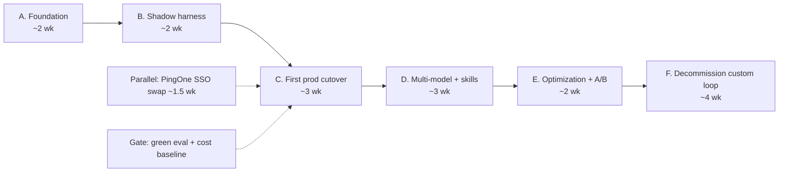

# 03 — Migration Roadmap

> Phased, gated plan to converge the in-process Bedrock loop **and** the custom-code AgentCore Runtime
> worker onto the managed Harness. Effort in **dev-weeks** (1 senior eng = 1 dev-week; assumes Rob +
> agents working model). Every phase has a gate, stop conditions, and a rollback.

## Assumptions

- The `AgentRuntime` seam ([factory.ts](../../packages/agent-runtime/src/factory.ts)) is the insertion
  point; a `HarnessRuntime` adapter is the third implementation. **This is the single biggest
  accelerator** — most phases are config + one adapter, not rewrites.
- Existing AgentCore Runtime work (specs/001–004, `apps/agentcore-agent`, spike stack) is prior art we
  build on, not throwaway.
- "Human-owned" changes (IAM, KMS, PingOne, network, deps) gate on Rob + InfoSec per [CLAUDE.md].

## How this differs from the mission's suggested phasing

The mission assumes greenfield AgentCore adoption. Because the **Runtime worker lane + seam already
ship**, three changes:
1. **Foundation must include the already-flagged pilot blockers** — private-subnet/PrivateLink and IAM
   tightening ([specs/003/plan.md](../../specs/003-agentcore-substrate/plan.md)) — not just Gateway.
2. **Shadow harness is cheap** — point the existing seam at a `HarnessRuntime` for the durable lane
   that already runs on AgentCore Runtime; near-zero app change.
3. **PingOne swap is a parallel track**, not sequenced inside the cutover (it's a NextAuth provider
   change with no DB migration — [02 §3](02-target-architecture.md)).

## Phase overview

---

## Phase A — Foundation (weeks 1–2, ~2.5 dev-weeks)

**Goals:** stand up Gateway + the first 2–3 targets, write tightened IAM/exec roles in IaC, and close
the network landmine — so a harness can run against a real tool safely.

- **In scope:** Gateway + targets `github` (remote_mcp parity), `databricks`, `m365-graph`; the
  `HarnessExecRole-*` roles ([specs/iam-and-execution-roles.md](specs/iam-and-execution-roles.md));
  **private subnets + NAT/PrivateLink** replacing the default-VPC public subnets
  ([01 §10](01-current-state.md)); tighten the spike Bedrock IAM from `*` to the 3 inference-profile ARNs.
- **Out of scope:** any user-facing change; creating harnesses.
- **Deliverables:** CDK for Gateway + roles + network; one Gateway target invokable from a test harness.
- **Success criteria:** a throwaway harness invokes `@databricks/run_sql` via Gateway with Identity-
  vault auth, in a private subnet, with scoped IAM. CloudTrail shows the call.
- **Risks:** Identity-vault connector setup for Databricks/M365 (auth is the hard part — SAP deferred);
  network change touching the imported RDS SG.
- **Rollback:** Gateway/roles/network are additive new stacks; tear down without touching prod ECS.
- **Stop conditions:** AgentCore not GA in the approved region; InfoSec hasn't cleared the microVM model;
  network change can't preserve RDS connectivity.

## Phase B — Shadow harness (weeks 3–4, ~2 dev-weeks)

**Goals:** run one low-risk use case on a **managed Harness** in parallel to the existing path, no
user-facing change; compare outputs + cost.

- **In scope:** build the `HarnessRuntime` adapter (third impl of `AgentRuntime`); a chat/Q&A harness;
  shadow the **durable lane that already targets AgentCore Runtime** — duplicate its traffic to the
  harness and diff. Wire token/cost metric ([observability-spec.md](specs/observability-spec.md)).
- **Out of scope:** routing real users to the harness.
- **Deliverables:** `HarnessRuntime` in `packages/agent-runtime`; shadow-compare report (output parity,
  latency, $/turn); the first GenAI Observability dashboards.
- **Success criteria:** ≥95% output parity on a transcript replay set ([transcripts:replay](../../package.json));
  first-token latency within 20% of the Runtime path; per-turn cost measured (not modeled).
- **Risks:** Notion same-origin relay unreachable from managed compute ([02 §10](02-target-architecture.md));
  honesty/attestation layer mapping; context-pack → `systemPrompt[]` fidelity.
- **Rollback:** shadow only — delete the harness; production path untouched.
- **Stop conditions:** parity < 90%; the relay/attestation gaps have no clean workaround; $/turn
  materially above [cost-model.md](specs/cost-model.md) projections.

## Phase C — First production cutover (weeks 5–7, ~3 dev-weeks)

**Goals:** route 10% → 50% → 100% of **one** use case (internal-docs Q&A — low risk, Haiku, no writes)
to the harness via versioned endpoints; establish the eval baseline.

- **In scope:** versioned endpoints `STAGING`/`PROD` ([02 §7](02-target-architecture.md)); shell routes
  a % of Q&A traffic to `InvokeHarness` (qualifier=`PROD`); eval gate live
  ([eval-and-optimization-loop.md](specs/eval-and-optimization-loop.md)). **Gate before ramp:** eval set
  green + cost baseline from Phase B.
- **Parallel:** PingOne SSO swap (~1.5 dev-weeks) — NextAuth provider change, `ping_subject` already
  wired ([02 §3](02-target-architecture.md)); land before exposing to broad GP users.
- **Out of scope:** durable/skill lanes; multi-model switching.
- **Deliverables:** % rollout control; eval baseline; rollback runbook (repoint `PROD` to prior version).
- **Success criteria:** at 100%, error rate ≤ current, faithfulness ≥ baseline, $/turn within projection,
  zero cross-user data incidents.
- **Risks:** PingOne integration timing; ramp surfacing edge cases evals missed.
- **Rollback:** drop the routing % to 0 (back to Bedrock loop) and/or repoint `PROD` endpoint — instant,
  no redeploy (vs today's forced ECS replace).
- **Stop conditions:** any cross-user leakage; faithfulness/honesty regression; PingOne not ready and
  GitHub-OAuth exposure unacceptable for the audience.

## Phase D — Multi-model + skills rollout (weeks 8–10, ~3 dev-weeks)

**Goals:** mid-session model switching where it pays; deploy the GP skills bundle to S3; enable
`awsSkills` for the AWS-ops agent.

- **In scope:** shell sets per-invocation `model` (Opus-plan → Sonnet-draft → Haiku-summarize); skills
  publish-on-promote pipeline → S3 ([skills-bundle-structure.md](specs/skills-bundle-structure.md));
  stand up the marketing-analytics + aws-ops harnesses ([create-harness-examples](specs/create-harness-examples/)).
- **Deliverables:** publish pipeline; 2 more production harnesses; cheap-ops moved to Haiku.
- **Success criteria:** measurable cost/turn drop from model-mix shift ([cost-model.md](specs/cost-model.md));
  a business user publishes a skill that a harness loads from S3 without eng involvement.
- **Risks:** skills format drift vs ADR 0002; no-secrets scan gaps; awsSkills role too broad.
- **Rollback:** pin harnesses to a single model; revert skill bundles to last-good S3 version; disable awsSkills.
- **Stop conditions:** skill publish leaks secrets; awsSkills agent exceeds read-only IAM intent.

## Phase E — Optimization loop on (weeks 11–12, ~2 dev-weeks)

**Goals:** enable AgentCore Optimization + A/B on the first prompt/tool-description recommendations.

- **In scope:** Optimization suggestions treated as candidate versions through the same eval + A/B gate
  ([eval-and-optimization-loop.md](specs/eval-and-optimization-loop.md)); A/B at p<0.05, N≥200.
- **Deliverables:** A/B dashboards; first optimizer-suggested change promoted via the gate.
- **Success criteria:** ≥1 statistically-significant quality win promoted; **no auto-promotions**.
- **Risks:** over-fitting to the judge; peeking on A/B.
- **Rollback:** repoint `PROD` to pre-optimization version.
- **Stop conditions:** optimizer changes degrade honesty/faithfulness; significance can't be reached at
  reasonable N.

## Phase F — Decommission custom orchestration (weeks 13–16, ~4 dev-weeks)

**Goals:** migrate remaining use cases (tool chat, durable, skill, scheduled) to harnesses; retire the
in-Fargate loop + the custom-code Runtime container; keep Fargate as the thin auth/API/SSE shell.

- **In scope:** move tool-local + durable + skill + scheduled lanes to harness endpoints; **graduate**
  app-build (J4) and agent-authored-notebook workloads to **Strands-on-Runtime** via
  `agentcore export harness` ([02 §10](02-target-architecture.md)); delete `runAgentLoop` hosting from
  `apps/web` and the `apps/agentcore-agent` *spike* once exports land; retire the runtime-v2 preview cluster.
- **Out of scope:** removing the `AgentRuntime` seam (keep it — it's how we target harness vs exported
  Strands per lane).
- **Deliverables:** all lanes on managed substrate; decommissioned loop + preview cluster; updated
  ENTERPRISE_READINESS + ARCHITECTURE docs.
- **Success criteria:** no production traffic on the hand-rolled loop for 2 weeks; cost + latency at/under
  baseline; one workload successfully running as exported Strands code.
- **Risks:** a lane that genuinely needs hooks/graph/bidi streaming (export path covers these);
  scheduled-lane cron (AgentCore has no product cron — our leased scheduler stays, [ROADMAP.md:266](../ROADMAP.md)).
- **Rollback:** the seam lets any lane fall back to `BedrockRuntime`/`AgentCoreRuntime` by config until
  the loop code is deleted; delete only after the 2-week clean window.
- **Stop conditions:** any lane can't meet parity/cost/latency on harness or exported Strands.

## Effort summary

| Phase | Dev-weeks | Gate to next |
|---|---|---|
| A Foundation | 2.5 | Gateway target invokable, private subnets, scoped IAM |
| B Shadow | 2.0 | ≥95% parity, cost measured |
| C Cutover (one use case) | 3.0 + 1.5 (PingOne) | eval green at 100%, no leakage |
| D Multi-model + skills | 3.0 | cost/turn drop, business-user publish works |
| E Optimization | 2.0 | ≥1 significant win promoted via gate |
| F Decommission | 4.0 | 2 wk clean off the old loop |
| **Total** | **~18 dev-weeks** (~16 calendar weeks with the parallel PingOne track) | |

## Global stop conditions (pause the whole program, reassess)
- AgentCore not GA / not compliant in the approved GP region.
- GP InfoSec rejects the microVM isolation or Identity-vault model.
- A cross-user data-scoping defect in any phase (highest-severity; the product's trust spine).
- Realized cost materially diverges from [cost-model.md](specs/cost-model.md) after Phase B baseline.
