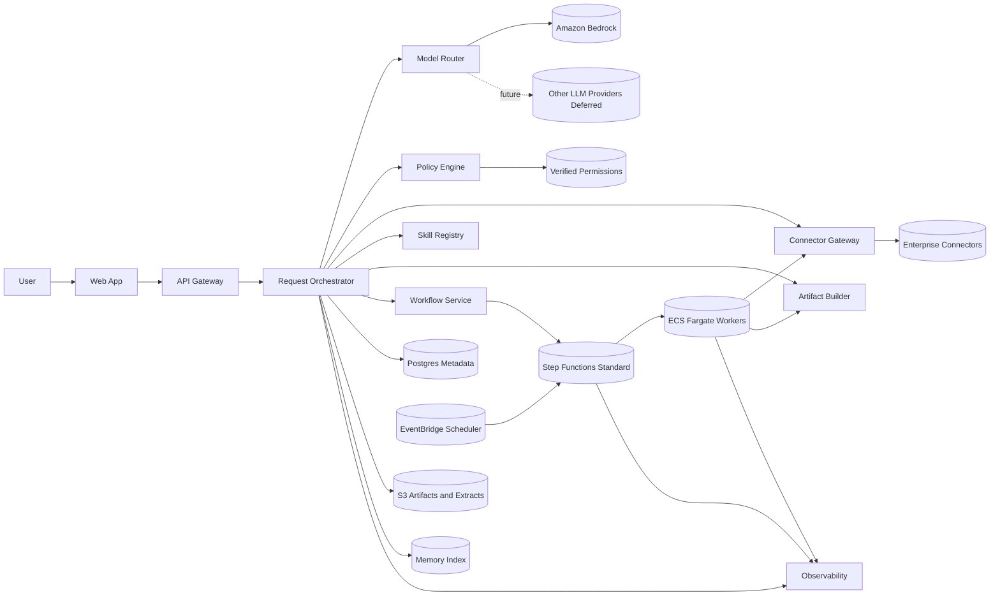
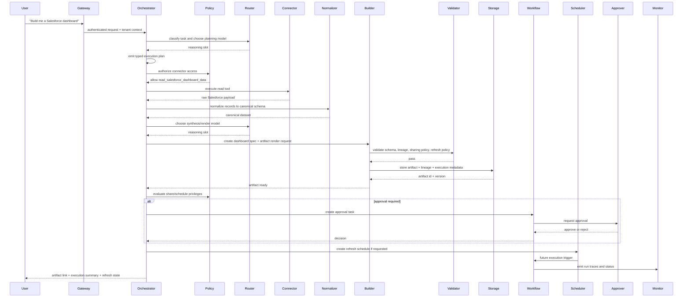

# AI Workbench Architecture — Deep Research Report

> **Provenance:** external deep-research report commissioned by Rob (2026-07-12),
> imported verbatim except for this header and removal of the source tool's
> non-resolving citation tokens. Research input behind docs/specs/multi-agent-orchestration-architecture.md (planner-led, tool-centric workbench on a durable workflow backbone); this report is evidence, not the spec of record.

## Bottom line

Comparative should be built as a **planner-led, tool-centric workbench on a durable workflow backbone**, not as an open-ended swarm of autonomous agents. The foreground request path should use a **single coordinator/planner** that produces a typed execution plan, invokes **bounded worker capabilities** through a governed connector layer, and hands long-running or scheduled work to **AWS Step Functions Standard workflows** with ECS/Fargate workers behind them. That architecture best fits Comparative’s actual jobs—artifact generation, connected-data summarization, dashboards, comparisons, and scheduled refresh—while preserving enterprise governance, auditability, and cost control. OpenAI’s current agent guidance, Anthropic’s subagent model, and LangGraph’s persistence docs all support specialization and resumability, but they do not support making dynamic multi-agent delegation the default for every business request. AWS Step Functions, by contrast, is explicitly built for auditable, long-running, human-in-the-loop workflows, and AWS’s broader stack aligns with the stated platform direction.

**Problem definition.** The capability solves a business-user problem: turning vague natural-language requests into governed work across enterprise systems, then packaging results into consumable artifacts such as presentations, dashboards, summaries, and recurring reports. It is valuable when the task spans multiple systems, requires permissions-aware data access, benefits from model reasoning, or produces a sharable artifact that may later refresh on a schedule. It is unnecessary when the request is a plain chat answer, a simple search over one known document, or a deterministic report that can be rendered from a fixed query and template without any planning layer.

**Recommendation.** Use **one planner + typed workers + durable background workflows**. Do **not** make “persistent autonomous agents,” “dynamic subagents by default,” or “MCP as the internal control plane” part of Phase 1. Support MCP as an adapter surface for external tools, because it is an increasingly important interoperability standard, but keep Comparative’s internal connector contract simpler and stricter than raw MCP. MCP’s authorization model is real and improving, but the standard is still evolving enough that it should not be your core governance substrate yet.

**Confidence.** **High** on the control-plane shape, governance model, and workflow backbone. **Moderate** on future memory infrastructure and managed-agent services, because AWS, OpenAI, Anthropic, Google, and Microsoft are all shipping rapidly in this area.

## Industry landscape and evidence

The strongest documented pattern across the current agent ecosystem is **not** “more agents everywhere.” It is **clear separation of concerns**: a thin orchestration layer, specialized reusable instructions or skills, explicit tool calls, persisted execution state, and human approval where risk is non-trivial. OpenAI currently distinguishes direct Responses API control from the Agents SDK, and positions the SDK for tool loops, handoffs, tracing, guardrails, and resumable approvals. Anthropic positions subagents as a way to isolate side-task context and permissions. LangGraph positions durable execution, persistence, and human-in-the-loop as core agent-runtime primitives. Microsoft separates **indexed connectors** from **real-time federated retrieval via MCP**. Google’s ADK and Agent Platform distinguish **session state** from **long-term memory** and explicitly warn against in-memory state for scaled production deployments. That is remarkably convergent evidence for a product like Comparative.

What is mostly **documented capability** today versus what remains more **marketing-heavy or speculative** is comparatively clear:

| Area | What is well-documented | What to treat cautiously | Why it matters for Comparative |
|---|---|---|---|
| OpenAI agents | SDK-managed tool loops, handoffs, tracing, guardrails, approvals, sandbox execution. | Broad “agentic everything” messaging around knowledge work and plugins. | Good reference for orchestration primitives, not a reason to expose agent concepts to users. |
| Anthropic subagents and skills | Subagents with separate context windows and permissions; skills as reusable instruction bundles; hooks and MCP integration. | Rich desktop/app ecosystem claims around universal integration surfaces. | Good evidence for bounded specialization and reusable workflows. |
| MCP | Open protocol for tools/context; formal authorization work based on OAuth; remote MCP servers are real. | Enterprise-ready uniform authorization and governance across all MCP servers. The standard still has active auth gap work. | Use as an adapter boundary, not your core internal contract. |
| LangGraph and CrewAI | LangGraph persistence, interrupts, and “durable execution” framing; CrewAI crews/flows/memory. | Framework-level “production ready from day one” claims without considering your ops model. | Useful libraries, but they should not be the architecture. |
| Microsoft and Google platforms | Copilot connectors split between synced/indexed and federated real-time retrieval; Agent Platform offers managed runtime/governance; ADK separates session/state/memory. | Their product surfaces are optimized for their own ecosystems. | Useful design references, not suitable as Comparative’s substrate. |
| AWS stack | Bedrock Converse provides a consistent cross-model interface; Step Functions supports durable, auditable human-in-loop workflows; EventBridge Scheduler scales scheduled tasks; Verified Permissions externalizes fine-grained auth. | Fully managed “agent runtime” offerings can tempt premature platform expansion. | Strongest fit for Comparative’s current stack and required governance. |

A second important pattern is that **durability belongs below the agent layer** for enterprise workloads. Step Functions Standard workflows are explicitly long-running, durable, auditable, and exactly-once; callback tasks are built to pause for human approvals or external completion events. Temporal’s own docs make the same durable-execution case in more general terms. LangGraph brings persistence and interrupts to the agent runtime, but it is still best understood as an application framework, not the enterprise workflow system of record. For Comparative, that means long-running builds, refreshes, approvals, retries, and notifications should sit on a workflow engine, while the planner and model loop stay bounded and replaceable.

A third pattern is that **memory must be scoped**. OpenAI’s recent guidance on memory compaction, LangGraph’s split between checkpointers and stores, Google ADK’s separation of Session/State/Memory, and Microsoft’s split between indexed and federated connector access all point in the same direction: not all “memory” is one thing, and mixing transient conversation state with long-lived enterprise knowledge is an architectural mistake.

## Architecture options and tradeoffs

The realistic options for Comparative collapse into five patterns.

| Pattern | Advantages | Disadvantages | Ops complexity | Governance/security | Latency/cost | Failure modes | Verdict |
|---|---|---|---|---|---|---|---|
| Single agent loop in app server | Simplest to prototype; low ceremony. | Weak durability, poor approval handling, hard to observe, easy to over-permission, brittle background execution. | Low at first, high later. | Weak unless heavily wrapped. | Low latency for simple requests; expensive when loops grow. | Lost state, hidden retries, duplicate side effects. | Reject for enterprise product. |
| Planner + typed workers in stateless app | Strong control, explicit plans, good governance, easy testing. | Needs a separate durable layer for long jobs. | Moderate. | Strong if permission checks are explicit. | Good synchronous latency; predictable cost. | Mostly bounded to step failure and connector errors. | Good, but incomplete alone. |
| Dynamic supervisor with subagents everywhere | Flexible specialization; useful for context isolation. | Harder to govern, debug, and budget; tool and prompt sprawl; unnecessary for many business tasks. | High. | Medium unless heavily sandboxed. | Higher token and orchestration cost. | Hidden delegation, inconsistent outputs, trace complexity. | Use sparingly, not as default. |
| Vendor-managed agent platform as core runtime | Faster initial setup; built-in runtime features. | Product lock-in, UX/governance constraints, limited control, hard to differentiate. | Moderate externally, hidden internally. | Varies by platform. | Often efficient early; less predictable strategically. | Dependency on vendor abstractions and release cadence. | Defer. |
| Durable workflow engine with bounded AI steps | Best for approvals, retries, schedules, refresh, audits, SLA handling. | Requires plan/state modeling; can feel more rigid. | Moderate and sustainable. | Strongest fit for enterprise controls. | Good for background work; some overhead per transition. | Explicit and recoverable. | Recommended backbone. |

The best architecture is therefore a **hybrid of the second and fifth rows**: a planner-led synchronous path for interactive requests, backed by a durable workflow engine for anything that can outlive a single request/response cycle. That is still **one architecture**, because the planner owns intent decomposition while the workflow engine owns durability. The alternatives fail for predictable reasons. The single-agent loop fails governance. The dynamic-subagent default fails maintainability and cost discipline. The vendor-platform-first approach reduces differentiation and adds lock-in. Temporal is excellent, but Step Functions fits the AWS-native requirement better today unless Comparative later proves a need for richer code-native workflow semantics than Step Functions comfortably supports.

**Why Temporal is not the first pick.** Temporal is a genuine durable-execution platform with powerful signals, queries, and long-running workflow support. If Comparative later needs extremely rich programmatic workflow logic, deeply interactive long-lived agents, or “continue forever” business processes beyond Step Functions’ design limits, Temporal is a serious candidate. But Step Functions is already managed, AWS-native, integrates directly with approvals and service calls, and matches the current deployment direction. For Comparative’s described workload, adding a separate durable-execution platform now would solve a later-stage problem too early.

**Why LangGraph and CrewAI are not the architecture.** LangGraph is useful if you need a sophisticated local agent graph with persistence and interrupts, and CrewAI is useful if you want opinionated multi-agent abstractions and flows. But Comparative is not trying to become an agent framework; it is trying to become a governed enterprise workbench. The architecture should therefore use agent frameworks only where they buy clarity inside a bounded worker, not as the product’s primary operating model.

**Why managed agent runtimes are deferred.** AWS now offers Bedrock AgentCore Runtime, Gateway, and Observability, and Bedrock Agents itself exposes orchestration templates and built-in knowledge-base integration. Those are real capabilities, not vapor. But they also imply an earlier commitment to a managed agent control plane than Comparative presently needs. Comparative still needs its own user-facing product semantics, its own connector permission model, and its own artifact lifecycle. A custom orchestration layer on ECS/Fargate remains the cleaner choice for now.

## Recommended architecture

**Component architecture.** Comparative should have these runtime components: a web client and API gateway; a request orchestrator that performs parsing, planning, and execution control; a model router that selects Bedrock model classes by task; a connector gateway that exposes only approved read and write tool surfaces; a permission layer that merges RBAC and ABAC decisions and externalizes fine-grained authorization in Cedar/Verified Permissions; a skill registry for reusable workflows and templates; an artifact builder that turns typed specs into PPTX, HTML, XLSX, PDF, and refreshable assets; a workflow service built on Step Functions Standard for scheduled and long-running jobs; an observability pipeline using structured logs plus OpenTelemetry/ADOT to X-Ray/CloudWatch; and storage split across relational metadata, object storage, search/memory indexes, and append-only audit records. Bedrock should be the primary model access layer because Bedrock Converse offers a consistent interface across supported models and because Guardrails, prompt caching, and prompt routing are available in that ecosystem.

**Request lifecycle.** For “Build me a Salesforce dashboard,” the system should: accept the request; classify intent and required artifact type; ask the planner to emit a structured plan; evaluate permissions before any connector call; invoke the connector gateway with a read-only Salesforce tool using the user’s or delegated org credentials according to policy; normalize the retrieved records into a canonical tabular schema; run reasoning over the normalized data to choose metrics, filters, and visualization layouts; generate a typed dashboard spec and, if needed, an HTML artifact spec; validate schema, data lineage, and sharing policy; render the artifact deterministically; persist the artifact, source references, execution trace, and refresh plan; optionally request human approval before sharing or scheduling; then register a refresh job in EventBridge Scheduler that starts a Step Functions workflow for future rebuilds. Step Functions callback tasks should gate any human approval checkpoint.

**Agent strategy.** Comparative should use **exactly this combination**: a **single foreground planner/coordinator**, **background workers**, and a **workflow engine**. It should use **specialist subagents only for narrow, high-value cases** such as isolated research over a large corpus or parallel artifact-section drafting, where separate context windows materially reduce noise. OpenAI and Anthropic both document specialization and subagents as deliberate tools for separate instructions, tools, or context isolation, not as a universal default. Comparative should therefore **not** implement persistent free-roaming agents, unconstrained agent-to-agent delegation, or “crew” metaphors in the user experience.

**Skills.** A Comparative skill should be a **versioned reusable work unit** that packages instructions, input schema, output schema, validation rules, optional assets/templates, and optional pre/post processors. Both OpenAI and Anthropic now treat skills as reusable instruction bundles, and OpenAI documents a formal `SKILL.md`-anchored format. For Comparative, a skill belongs inside the orchestrator contract only if it is reusable across prompts and testable against fixed fixtures—for example, “Executive dashboard from CRM opportunity data,” “Board-ready quarterly summary,” or “Variance analysis across two datasets.” One-off business logic, connector credentials, authorization rules, and artifact ownership do **not** belong inside a skill. Keep those outside, in policy, connectors, and artifact metadata.

**Memory.** Comparative should maintain five separate memory scopes. Conversation memory stores short summaries of prior turns, selected user preferences, and references to produced outputs; it should never store raw connector dumps by default. Project memory stores durable working context—approved datasets, selected templates, assumptions, and objectives—for a named thread of work. Artifact memory stores lineage, render specs, validation results, and refresh configuration for each generated artifact. Organization memory stores curated, approved knowledge sources and their access controls; this is the place to add Bedrock Knowledge Bases later, ideally with S3 Vectors if storage cost matters more than ultra-low-latency retrieval. Connector memory stores connector metadata only—schemas, capability descriptors, sync cursors, rate-limit state, and cached tool manifests—not business content. LangGraph, OpenAI, Google ADK, and Microsoft all point toward this kind of scoped approach instead of one undifferentiated “memory.” AWS’s managed knowledge-base stack also now supports cost-optimized vector storage through S3 Vectors.

**Connector governance.** The connector layer should enforce least privilege at four boundaries: identity, credential scope, tool action, and data egress. Every connector must declare whether it supports read, write, or admin actions. Read and write must be separate tools. User-granted credentials should remain outside prompts and never be passed to model context. Policy must be checked before connector invocation and again before artifact sharing or external side effects. RBAC should encode broad business roles; ABAC should encode tenant, workspace, data sensitivity, artifact classification, and connector-resource ownership. Verified Permissions with Cedar is a good fit for the application authorization plane because it cleanly externalizes fine-grained decisions. Comparative should record every tool invocation in an auditable store with subject, action, resource, policy result, execution ID, and artifact ID. Microsoft’s synced-versus-federated connector split is the right mental model: some content should be indexed for search; some should stay live and permissions-checked at query time.

**Model routing.** Define five abstract slots, not hard-coded vendor names: **cheap**, **reasoning**, **large**, **vision**, and **verification**. Route simple classification, extraction, routing, title generation, and short summaries to the cheap slot. Route plan creation, multi-step synthesis, and artifact content decisions to the reasoning slot. Use the large slot only when the planner predicts unusually complex synthesis, large-context reconciliation, or executive-quality language constraints. Use the vision slot for image- or slide-aware tasks. Use the verification slot for rubric-based review, contradiction checks, citation coverage checks, and artifact QA. Bedrock should remain the first hop because Converse gives a uniform invocation surface across supported models, Bedrock Guardrails can add content and PII filtering, intelligent prompt routing can optimize within a model family, and prompt caching can cut latency and repeated-input cost for stable prefixes. But Comparative should keep provider selection in its own router because Bedrock’s intelligent prompt routing is within a model family, not a universal cross-provider planner.

**Cost optimization.** The cost rules should be conservative and explicit. First, short-circuit to deterministic code whenever a task is rules-based. Second, keep static instructions, templates, and tool schemas at the front of prompts so Bedrock prompt caching can work. Third, use verification models and schema validators to catch failures without escalating every request to a premium model. Fourth, never let background refresh jobs default to the large slot. Fifth, cache connector metadata and schema introspection separately from artifact content. Sixth, prefer storage-backed memory and user-visible replay over repeated model reasoning. Bedrock’s prompt caching and DynamoDB’s on-demand scaling model support this bias toward paying for actual usage rather than pre-provisioning complexity.

**Background execution.** Scheduled jobs, refresh workflows, and long-running artifact builds should run through Step Functions Standard workflows started by EventBridge Scheduler. Use Step Functions callback tasks for approval checkpoints and external completion waits. Use SQS between Step Functions and ECS workers when a task needs backpressure or fan-out. Standard workflows are a better fit than Express here because Comparative cares more about auditability, durability, and exactly-once semantics than about ultra-high-throughput event processing. If a workflow risks hitting Step Functions history limits, use the recommended continuation pattern to start a new execution with carried-forward state.

**Observability.** Comparative needs four observability layers: developer traces, operator metrics, audit logs, and user-visible execution history. Use OpenTelemetry instrumentation through ADOT to send traces and metrics to X-Ray and CloudWatch. The trace model should capture request ID, tenant ID, plan ID, tool calls, model calls, token counts, retry counts, approval waits, and artifact render stages. An append-only audit log should separately capture who accessed which connector resource and why. Users should see a sanitized execution timeline showing plan steps, approvals, and artifacts, but not raw prompts, secrets, or internal policy content. OpenAI’s agent tracing model is good supporting evidence for why tool calls, handoffs, and guardrails should be first-class trace spans, even if Comparative runs on Bedrock rather than OpenAI.

**Security.** Use layered controls for prompt injection and tool risk. Bedrock Guardrails can help with harmful content and PII filtering, but AWS explicitly notes that sensitive-information filters do not detect PII in structured `tool_use` output parameters; tool safety therefore must not rely on Guardrails alone. Apply pre-tool policy checks, output validation, content sanitization, URL/domain allowlists for any browsing tool, least-privilege connector scopes, mandatory approval for writes and external sharing, and secret redaction before traces are stored. OWASP, OpenAI, Google, and Anthropic all support the core point that prompt injection is a real top-tier risk and that layered defenses are required. Encrypt artifacts and extracted source data in S3 with KMS where tenancy or audit requirements justify customer-managed keys. Rotate connector secrets through Secrets Manager.

**Scalability.** Horizontal scale should occur at the API tier, planner tier, artifact workers, and connector adapters. Fargate is a good fit for those stateless services because it is serverless and pay-as-you-go, and ECS service auto scaling is mature. The stateful components are the relational metadata store, object storage, workflow state, scheduler definitions, and memory/search indexes. The most likely bottlenecks are not CPU first; they are connector rate limits, model latency, background render concurrency, and permission-check fan-out. That is another reason to keep plans typed and connector actions bounded.

**Future evolution.** Phase 1 should ship the governed workbench: planner, read-only connectors, artifact builders, request traces, RBAC+ABAC, approvals, and scheduled refresh. Phase 2 should add enterprise SSO, richer memory, skill publication and testing, more artifact templates, and controlled write actions. Phase 3 should add optional subagent use, organization-wide knowledge indexing with managed retrieval, and only then reconsider managed agent runtimes or a stronger workflow substrate if product evidence demands them. That sequencing matches the maturity of the current ecosystem and minimizes irreversible complexity.

## docs/research/comparative-ai-workbench-architecture-research.md

The following research document encodes the evidence-backed recommendation above. It intentionally distinguishes documented capabilities from platform claims and ends with open questions that engineering should validate before implementation. The conclusions in the document are grounded in the primary sources already cited in this report, especially the official documentation from AWS, OpenAI, Anthropic, Google, and Microsoft.

```markdown
# Comparative AI Workbench Architecture Research

## Executive Summary

Comparative should adopt a planner-led, tool-centric architecture with a durable workflow backbone.

The recommended shape is:

- interactive requests handled by a single coordinator/planner
- connector access mediated by a governed connector gateway
- long-running, scheduled, and approval-bound work handled by a workflow engine
- artifact rendering performed by deterministic builders from typed specifications
- memory separated into scoped layers instead of one global memory store

This architecture is simpler than a dynamic multi-agent swarm, easier to govern than framework-native autonomous systems, and better aligned to Comparative’s workload: connected enterprise data, reusable artifacts, scheduled refresh, and non-technical business users.

The key rejection is deliberate:

Comparative should **not** make dynamic subagents, persistent autonomous agents, or framework-centric agent orchestration the default model for product execution.

## Industry Landscape

### OpenAI Codex and OpenAI Agents

What matters:

- skills are becoming reusable workflow bundles
- subagents/specialists are useful when context isolation matters
- approvals, traces, and tool loops are first-class concerns
- long-running work is increasingly treated as parallel, resumable task execution

What does **not** transfer directly:

- coding-agent UX
- repository-centric assumptions
- unconstrained local tool execution

Implication for Comparative:

Borrow runtime patterns, not product metaphors.

### Claude Code and Anthropic Subagents

What matters:

- subagents are best used for bounded specialization
- separate context windows reduce noise
- permissions can differ by subagent
- skills are reusable instruction bundles

Implication for Comparative:

Specialists are a runtime optimization, not the core user-facing architecture.

### MCP Ecosystem

What matters:

- MCP is becoming the common interoperability layer for tools and external systems
- remote MCP servers are increasingly real
- authorization is improving, but still evolving

Implication for Comparative:

Support MCP at the edge through adapters.
Do not make raw MCP the internal contract for permissions or tool execution.

### LangGraph, CrewAI, and Agent Frameworks

What matters:

- persistence, interrupts, human-in-the-loop, and resumability are useful primitives
- framework-managed graphs can simplify bounded worker logic

What does not justify adoption as the core architecture:

- Comparative is not selling an agent framework
- product governance should not depend on framework semantics

Implication for Comparative:

Frameworks may be used inside isolated worker services if needed.
They should not own the architecture.

### Microsoft Copilot and Google Gemini Platforms

What matters:

- connectors split naturally into indexed and live/federated modes
- managed session state and long-term memory are treated separately
- orchestration, data access, and governance are converging

Implication for Comparative:

Separate connector ingestion from live connector execution.
Treat memory scopes explicitly.

### Durable Execution Systems

What matters:

- long-running jobs need durable state, retries, pauses, and approvals
- workflow durability is not the same thing as chat history persistence

Implication for Comparative:

Use a workflow backbone for all scheduled, approval-gated, and extended work.

## Evidence

### Documented capabilities

- OpenAI Agents SDK: orchestration, tools, tracing, approvals, handoffs
- Claude Code: subagents, skills, hooks, MCP integration
- MCP spec: open protocol, OAuth-based auth work
- LangGraph: persistence, interrupts, durable execution framing
- Copilot connectors: synced/indexed and federated/MCP modes
- Google ADK and Agent Platform: session/state/memory distinction
- Bedrock Converse: unified model invocation
- Step Functions Standard: durable, auditable, exactly-once, human approval capable

### Production architecture patterns

The mainstream production pattern is converging on:

- explicit tool boundaries
- persisted execution state
- approval checkpoints
- reusable workflow instructions
- model routing
- scoped memory
- observability at the level of tool calls and workflow stages

### Research concepts

Promising but not required for Comparative now:

- persistent autonomous coworkers
- open-ended self-improving agent societies
- agent marketplaces as core product substrate

### Marketing claims

Treat cautiously:

- “one platform to build any agent”
- “production ready from day one”
- “fully autonomous knowledge work”

These claims often compress real governance and observability work into abstraction layers that enterprises still need to own.

## Comparison Tables

### Architecture patterns

| Pattern | Strengths | Weaknesses | Recommendation |
|---|---|---|---|
| Single agent loop | simplest prototype | weak durability, weak governance | reject |
| Planner + typed workers | explicit, testable, governable | needs durable backend for long jobs | adopt |
| Dynamic subagent default | flexible specialization | hard to govern and budget | reject as default |
| Managed agent platform core | faster setup | lock-in, reduced control | defer |
| Durable workflow backbone | approvals, retries, schedules, audits | requires explicit state modeling | adopt |

### Workflow technology choices

| Technology | Best use | Why not primary for all Comparative logic |
|---|---|---|
| Step Functions Standard | durable business workflows, approvals, refresh jobs | state-machine style is not ideal for every small synchronous request |
| Temporal | very rich durable execution | adds another platform too early |
| LangGraph | bounded agent graphs with persistence | framework should not be the system of record |
| CrewAI | opinionated multi-agent flows | not aligned to Comparative’s need for tight governance |

### Connector strategy choices

| Strategy | Good for | Risk |
|---|---|---|
| Live federated access | current data, strong permission alignment | latency and rate-limit dependency |
| Indexed ingestion | search and organization memory | stale data and indexing governance |
| Hybrid | best overall fit | requires strict policy clarity |

## Tradeoffs

The core tradeoff is between flexibility and governability.

Comparative gains credibility by being predictable:

- deterministic artifact rendering
- explicit permission checks
- resumable background jobs
- visible execution history

Comparative loses credibility if it behaves like an opaque autonomous agent swarm.

The recommended architecture deliberately chooses bounded intelligence over maximum-open-ended autonomy.

## Sources

Primary sources used:

- AWS Bedrock documentation
- AWS Step Functions documentation
- AWS EventBridge Scheduler documentation
- AWS Verified Permissions and Cedar documentation
- AWS OpenTelemetry/X-Ray documentation
- OpenAI Agents SDK and Codex documentation
- Anthropic Claude Code and MCP documentation
- MCP specification and authorization materials
- Microsoft Copilot and Copilot Studio documentation
- Google Gemini Enterprise Agent Platform and ADK documentation
- LangGraph documentation
- Temporal documentation
- CrewAI documentation

## Open Questions

- Which connectors require write actions in Phase 1, if any?
- Is organization memory needed at launch, or can it wait until curated corpora exist?
- Is direct provider access outside Bedrock required for any capability that Bedrock lacks?
- What artifact types are mandatory at launch: PPTX, HTML, XLSX, PDF, DOCX?
- What approval policy should apply to external sharing and scheduled refresh?
- What tenant isolation level is required for enterprise customers: logical only, account-per-tenant, or hybrid?
```

## docs/specs/comparative-ai-workbench-architecture.md

The following specification is the implementation-facing design authority. It removes the research narrative and collapses the recommendation into decisions, interfaces, flow control, and phased delivery. It assumes an AWS-hosted stack with Bedrock as the primary model layer, ECS/Fargate for app services, Step Functions for durable jobs, EventBridge Scheduler for recurring work, and fine-grained authorization externalized through a policy engine. Those assumptions are directly supported by the cited AWS capabilities discussed above.

```markdown
# Architecture Decision Record

## Decision

Comparative will implement a planner-led, tool-centric architecture with a durable workflow backbone.

Interactive requests will run through a single coordinator/planner.
Long-running and scheduled work will run through Step Functions Standard workflows.
Workers will run on ECS/Fargate.
Models will be accessed primarily through Amazon Bedrock.
Artifacts will be rendered by deterministic builders from typed specs.

## Context

Comparative is an enterprise AI workbench for non-technical knowledge workers.

Core jobs include:

- build a PowerPoint from connected business systems
- build an HTML dashboard
- compare two datasets
- generate executive summaries
- create reusable artifacts
- refresh artifacts on a schedule

The product must optimize for:

- simplicity
- governance
- cost efficiency
- observability
- maintainability
- enterprise security
- future support for reusable skills, scheduled work, and memory

## Goals

- Provide invisible intelligence for business users
- Keep tool use explicit and governable
- Support multiple model classes through one routing layer
- Enable scheduled refresh and long-running builds
- Preserve complete execution history for operators and users
- Support reusable skills without exposing agent complexity
- Maintain strong authorization and least privilege

## Non-goals

- Open-ended autonomous agents as a primary product concept
- Dynamic subagent swarms as the default execution model
- MCP as the internal control plane
- Fully general autonomous write access to enterprise systems in Phase 1
- User-facing model selection as a core UX element

## Architecture Diagram



## Component Definitions

### User

Business user who issues requests, reviews artifacts, approves sensitive actions, and shares outputs.

### Gateway

Terminates auth, enforces tenant context, rate limits API calls, and forwards authenticated requests to the orchestrator.

### Planner

Parses user intent and emits a typed plan:
- requested artifact type
- required data sources
- execution stages
- risk level
- approval requirements
- model class selection hints

The planner does not hold credentials and does not call connectors directly.

### Memory

Memory is split into scoped stores:

- conversation memory
- project memory
- artifact memory
- organization memory
- connector memory

No single global memory store is allowed.

### Connector Layer

Provides a unified internal tool contract:

- list capabilities
- validate arguments
- execute read action
- execute write action
- return normalized payload
- emit audit event

Every connector action declares:
- read or write
- required scopes
- data classification
- idempotency behavior
- pagination behavior
- retryability

### Permission Layer

Performs authorization before:
- connector calls
- artifact sharing
- schedule creation
- write actions
- memory promotion
- skill publication

Uses RBAC plus ABAC, with fine-grained decisions externalized to Verified Permissions.

### Skills

Reusable workflow bundles with:
- metadata
- input schema
- output schema
- instructions
- validation rules
- assets/templates
- tests

Skills do not contain secrets or authorization rules.

### Artifact Builder

Converts typed specs into artifacts.

Artifact generation pipeline:
- spec generation
- schema validation
- deterministic render
- post-render validation
- storage
- lineage association

LLMs may propose structure and copy, but rendering must be deterministic.

### Background Jobs

Own:
- scheduled refresh
- long-running builds
- approval waits
- retries
- notifications
- resumable execution

Implemented with Step Functions Standard plus ECS workers.

### Observability

Captures:
- request logs
- structured traces
- token usage
- model cost
- connector latency
- render latency
- approval wait time
- failure classification
- audit events
- user-visible timeline

### Model Router

Resolves each model invocation to one of five slots:
- cheap
- reasoning
- large
- vision
- verification

The router is config-driven and provider-agnostic.

### Policy Engine

Computes runtime policy across:
- user role
- workspace
- tenant
- connector scope
- data sensitivity
- artifact classification
- action type
- destination type

### Storage

- Postgres for metadata and transactional state
- S3 for artifacts, extracts, plans, and audit archives
- memory index for scoped retrieval
- scheduler definitions in EventBridge
- workflow state in Step Functions
- secrets in Secrets Manager

### LLM Providers

Primary:
- Amazon Bedrock

Deferred:
- direct non-Bedrock provider integrations unless required by a concrete missing capability

## Sequence Diagram



## API Boundaries

### Public API

- `POST /v1/requests`
- `GET /v1/requests/{request_id}`
- `GET /v1/requests/{request_id}/timeline`
- `POST /v1/artifacts`
- `GET /v1/artifacts/{artifact_id}`
- `POST /v1/artifacts/{artifact_id}/share`
- `POST /v1/schedules`
- `GET /v1/schedules/{schedule_id}`
- `POST /v1/approvals/{approval_id}/decision`
- `GET /v1/skills`
- `POST /v1/skills`
- `POST /v1/skills/{skill_id}/test`

### Internal Orchestrator Contracts

#### Plan Contract

Input:
- natural language request
- user/tenant/workspace context
- optional artifact context
- optional project context

Output:
- `plan_id`
- `task_type`
- `artifact_type`
- `required_tools[]`
- `required_permissions[]`
- `requires_approval`
- `requires_background_execution`
- `model_slot_plan`
- `validation_plan`

#### Connector Contract

Methods:
- `list_tools()`
- `describe_tool(tool_name)`
- `execute_read(tool_name, args, principal_context)`
- `execute_write(tool_name, args, principal_context, approval_token?)`

#### Artifact Builder Contract

Methods:
- `render(spec, asset_context)`
- `validate_render(output_ref)`
- `extract_preview(output_ref)`

#### Workflow Contract

Methods:
- `start_job(job_type, payload)`
- `resume_job(job_id, signal)`
- `cancel_job(job_id)`
- `get_job_status(job_id)`

## Data Flow

### Interactive request path

1. request accepted
2. planner emits typed plan
3. policy checked
4. connector data retrieved
5. data normalized
6. reasoning performed
7. typed spec generated
8. artifact rendered
9. validations run
10. artifact stored
11. timeline emitted

### Background path

1. schedule or long job created
2. Step Functions execution starts
3. ECS worker executes bounded step
4. state persisted between steps
5. retries handled per step
6. approval callbacks wait if required
7. final artifact version stored
8. notifications emitted

## Permission Model

### Principles

- deny by default
- least privilege
- read and write separated
- policy checked before tool call
- policy checked before side effect
- every decision auditable

### RBAC

Use roles such as:
- workspace_viewer
- workspace_editor
- artifact_owner
- analyst
- admin

### ABAC

Use attributes such as:
- tenant_id
- workspace_id
- artifact_classification
- connector_name
- connector_resource_type
- connector_scope
- data_sensitivity
- environment
- sharing_destination

### Approval Rules

Require approval for:
- all connector write actions in Phase 1
- artifact sharing outside workspace
- schedule creation on sensitive data
- large-cost runs above configurable threshold
- memory promotion into organization memory
- connector actions that cross tenant or workspace boundary

## Failure Handling

### Retry Policy

- connector 429 and transient 5xx: exponential backoff with jitter
- model timeouts: retry once on same slot, then escalate if configured
- render failures: retry deterministic render step only
- authorization failures: never auto-retry
- validation failures: fail closed and surface to user

### Idempotency

Require idempotency key for:
- artifact creation
- share actions
- schedule creation
- write connector actions
- resume signals

### Recovery

- interactive path: retry bounded step or convert to background job
- background path: replay from last successful durable step
- approval wait: resume by callback token
- long workflow rollover: continue with new execution when history limits are approached

## Model Routing

### Slots

#### Cheap

Use for:
- intent classification
- small transforms
- extraction
- short summaries
- metadata generation
- verification when deterministic checks already passed

#### Reasoning

Use for:
- planning
- synthesis
- metric selection
- narrative generation
- artifact sectioning
- multi-step analysis

#### Large

Use only when:
- context size exceeds reasoning slot threshold
- synthesis is unusually complex
- executive language quality requires escalation
- repeated failure in reasoning slot justifies higher-cost retry

#### Vision

Use for:
- interpreting uploaded images
- slide/image QA
- chart understanding
- screenshot-based validation

#### Verification

Use for:
- rubric scoring
- contradiction detection
- citation coverage checks
- risk review
- final semantic QA

### Escalation Rules

- cheap -> reasoning if confidence low or tool count > configured threshold
- reasoning -> large if context too large or verification fails for quality
- any slot -> human approval if requested action is sensitive
- vision invoked only when multimodal input exists
- verification never performs side effects

### Cost Rules

- no large slot on first pass for refresh jobs
- prompt caching enabled for stable prefixes
- deterministic validators run before verification model
- verification model should be cheaper than generation path when possible
- maintain per-skill routing defaults

## Deployment Assumptions

- AWS hosted
- ECS/Fargate for web, API, orchestrator, connector adapters, artifact workers
- Amazon Bedrock for primary model calls
- Step Functions Standard for durable workflows
- EventBridge Scheduler for recurring jobs
- Postgres for application metadata
- S3 for artifacts and extracts
- Secrets Manager for connector secrets
- Verified Permissions for fine-grained authorization
- CloudWatch + X-Ray + OpenTelemetry for observability

## Configuration

### Required environment configuration

- Bedrock region and model slot mappings
- connector registry
- policy store id
- KMS key ids
- artifact bucket names
- job queue identifiers
- approval policy thresholds
- schedule limits
- token/cost budget thresholds
- allowed external share destinations
- prompt caching toggles per slot
- tracing and audit sinks

## Required Interfaces

- Auth principal interface
- Policy decision interface
- Connector tool interface
- Plan schema
- Canonical dataset schema
- Artifact spec schema
- Execution timeline schema
- Skill manifest schema
- Job signal schema
- Audit event schema

## Required Services

- Web App
- API Gateway/App API
- Request Orchestrator
- Model Router
- Connector Gateway
- Policy Service
- Artifact Builder Service
- Workflow Service
- Approval Service
- Schedule Service
- Skill Registry Service
- Memory Service
- Observability Pipeline

## Acceptance Criteria

- A user can request a Salesforce dashboard and receive an artifact plus execution timeline
- The system blocks unauthorized connector access before data retrieval
- The system records every connector call and authorization result
- The system can schedule a refresh and execute it durably
- A failed background step can resume without duplicating side effects
- Artifact output includes lineage to source connector calls and data snapshot identifiers
- Skill versions can be tested against fixtures before publication
- Shared artifacts enforce policy on destination and audience
- The user-visible timeline excludes secrets and internal prompts
- Model cost and token usage are visible per request and per workspace

## Risks

- Over-scoping Phase 1 into autonomous-agent features
- Connector sprawl without strict contracts
- Inconsistent data normalization across connectors
- Cost drift from using high-end models by default
- Prompt injection through tool outputs or connector content
- Weak lineage if raw extracts are not versioned
- Schedule explosion from unbounded refresh creation

## Deferred Work

- persistent autonomous agents
- direct non-Bedrock provider integrations
- MCP-native internal control plane
- organization-wide memory indexing at launch
- write-capable connectors without approval
- general-purpose computer-use automation
- custom agent frameworks as the primary runtime

## Implementation Phases

### Phase 1

- interactive planner path
- read-only connectors
- PPTX and HTML artifact builders
- execution timeline
- policy service
- Step Functions for long jobs and refresh
- GitHub authentication behind an auth abstraction
- basic skills registry with private workspace scope

### Phase 2

- enterprise SSO
- richer artifact set
- approval matrix expansion
- organization memory
- write connectors with approval
- skill testing and publishing workflow
- workspace admin controls
- cost dashboards

### Phase 3

- limited subagent execution for specific workloads
- managed retrieval for large organization corpora
- optional direct provider integrations if capability gaps remain
- reassess managed agent runtimes only if there is clear operational benefit

## Questions for Engineering

- Should Postgres be Aurora Serverless v2 or managed RDS Postgres?
- Which artifact formats are mandatory in the first release?
- Which connectors are in scope at launch and which are read-only?
- Is refresh frequency capped per workspace?
- What data retention policy applies to extracts, traces, and artifacts?
- What tenancy model is required for enterprise customers?
- What is the approval UX for mobile or email-driven decisions?

# Codex Implementation Notes

## Required repositories

Preferred recommendation: use a single monorepo unless a company standard already forbids it.

Recommended repo structure:

- `apps/web`
- `apps/api`
- `apps/worker`
- `packages/contracts`
- `packages/connectors`
- `packages/skills`
- `packages/policy`
- `packages/artifact-builders`
- `infra/aws`

If Comparative already has separate repositories, mirror the same boundaries.

## Files likely to change

High-probability touch points:

- request API routes
- auth middleware
- planner service
- model router
- connector registry
- policy adapter
- artifact builder interfaces
- job/workflow adapters
- execution timeline UI
- workspace settings UI
- schedule management UI
- infrastructure definitions for ECS, Step Functions, EventBridge, S3, Postgres, and permissions

## New services

Create these new deployable services if they do not already exist:

- orchestrator service
- connector gateway service
- artifact builder worker
- workflow service
- policy service
- skill registry service
- memory service

## Configuration

Add configuration for:

- model slot mapping
- workflow retry policy
- approval thresholds
- connector allowlists
- KMS keys
- artifact buckets
- audit sinks
- Bedrock prompt caching flags
- workspace budgets
- refresh cadence limits

## Interfaces

Define typed contracts first:

- `Plan`
- `ConnectorTool`
- `CanonicalDataset`
- `ArtifactSpec`
- `PolicyDecision`
- `ExecutionTimelineEvent`
- `SkillManifest`
- `JobPayload`
- `ApprovalDecision`

No implementation should begin before these contracts exist and are versioned.

## Suggested implementation order

1. Define contracts and schemas
2. Build auth abstraction and principal model
3. Implement policy adapter and authorization middleware
4. Implement orchestrator with mock connectors
5. Implement connector gateway and first real read-only connector
6. Implement canonical normalization pipeline
7. Implement first artifact builder
8. Implement execution timeline persistence and UI
9. Integrate Step Functions for background jobs
10. Add scheduling
11. Add skill registry and versioning
12. Add verification pipeline and cost accounting

## Migration strategy

If Comparative already has a simpler chat-style request pipeline:

- keep the existing synchronous path alive behind a feature flag
- route only selected artifact intents into the new planner path
- store both old and new timeline events during migration
- progressively move connectors behind the connector gateway
- move background refresh last, after artifact lineage is reliable

## Backward compatibility

- preserve current request IDs if already exposed externally
- wrap legacy connector calls behind the new connector interface
- keep existing artifact URLs stable; add version metadata instead of changing path semantics
- add new permission checks in monitor mode first where possible

## Testing strategy

Required test layers:

- schema tests for all contracts
- unit tests for planner routing and policy decisions
- connector contract tests with recorded fixtures
- artifact golden-file tests
- workflow replay tests
- idempotency tests for write paths
- adversarial prompt-injection tests on connector output
- cost-budget tests on routing escalation
- end-to-end tests for request -> artifact -> schedule -> refresh

## Definition of Done

A feature is done only when:

- contracts are versioned
- policy checks are enforced
- timeline events are emitted
- audit events are recorded
- retries are bounded and idempotent
- costs are attributed
- artifacts are lineage-linked
- operators can trace failures
- users can understand what happened without seeing internal secrets
- rollout is protected by flags and migration notes
```
