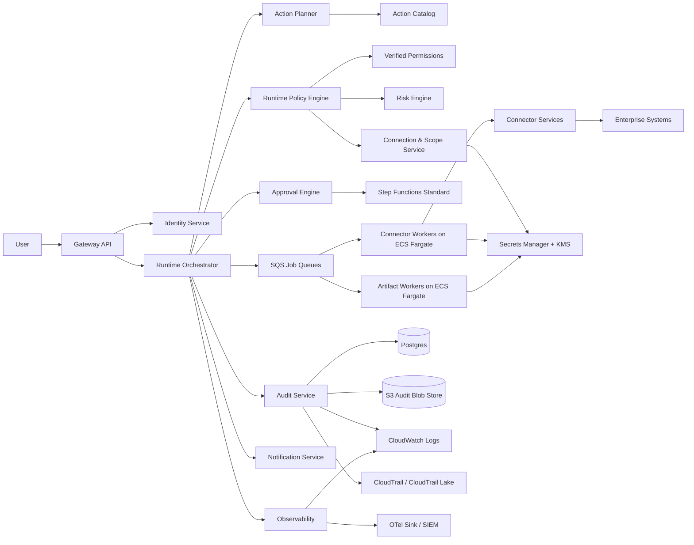
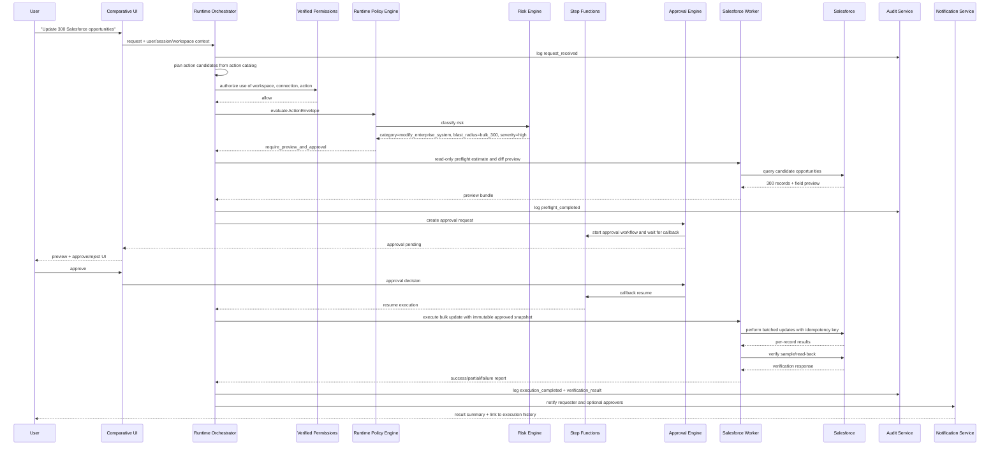

# Runtime Governance — Deep Research Report

> **Provenance:** external deep-research report commissioned by Rob (2026-07-12),
> imported verbatim except for this header and removal of the source tool's
> non-resolving citation tokens. Research input for the runtime action-governance direction (action catalog, deterministic policy engine, durable approvals); complements docs/CONNECTOR_GOVERNANCE_SPEC.md (connection-time governance) on the research/connector-governance-architecture branch.

## Research method

This recommendation is grounded in primary technical documentation from Anthropic, OpenAI, Google Cloud, Microsoft, AWS, MCP, LangGraph, OPA, OpenFGA, SpiceDB, Temporal, and Step Functions. The most important recurring pattern across current systems is not “let the model govern itself,” but the opposite: keep the trusted runtime outside the model and outside the execution sandbox; make tool execution explicit; persist approval and resume state durably; and treat permissions, network boundaries, and audit as first-class runtime concerns. OpenAI’s current Agents guidance explicitly says the server should own deployment, tools, state, and approval decisions, while Codex documentation separates sandbox boundaries from approval policy. Anthropic’s Claude Code similarly exposes deterministic hooks, tool permissions, and subagents with independent permissions rather than relying on prompts alone. LangGraph and Temporal both treat human intervention as an interruption or signal that must be durably persisted. MCP’s own spec and security guidance are even more explicit: tool metadata is not a security control, explicit consent is required, token passthrough is forbidden, and least-privilege scopes matter.

The evidence also points to a practical boundary for Comparative. Bedrock Guardrails, Copilot Studio DLP, Google’s Semantic Governance, and similar controls are useful, but they solve only pieces of the problem. Bedrock Guardrails handle content filters, PII masking, prompt-attack detection, and output verification, but they are not a general-purpose policy/approval system for enterprise actions. Google’s Semantic Governance is interesting because it evaluates each proposed tool call against user intent and policy, but Google labels it Preview, notes that it uses an LLM, warns that verdicts may not be accurate, and states that it does not replace baseline controls such as IAM and network security. Microsoft’s Copilot Studio governance is centered on connector grouping, DLP, authentication, endpoint filtering, tool blocking, publishing restrictions, and trigger restrictions. Those are valuable governance layers, but they reinforce the same conclusion: enterprise runtime governance must be layered, deterministic at the action boundary, and durable under failure.

## docs/research/runtime-governance-research.md

**Executive Summary**

Runtime governance exists to control the gap between what an LLM *proposes* and what an enterprise system is actually allowed to *do*. In Comparative, that gap matters because users are non-technical, enterprise data is connected to tools and schedules, actions can create or modify durable business artifacts, and unattended jobs can continue acting long after the original chat turn is over. The architectural risks are unauthorized action, excessive data access, unintended data export, prompt-injection-induced tool misuse, unsafe unattended execution, poor failure recovery for long-running jobs, and weak auditability. The operational risks are stale permissions, missing token rotation, badly tuned approval thresholds, runaway schedules, noisy or incomplete logs, and weak incident response. Risks that belong outside Comparative include enterprise-wide DLP/CASB policy across other applications, endpoint/browser hardening on customer devices, authoritative org hierarchy and HR approver data, and the source-of-truth compliance definitions for regulated records.

The strongest cross-vendor implementation pattern is a **trusted host runtime** that owns tool definitions, approvals, business-system access, tracing, and secrets, while any sandbox or execution substrate is treated as a subordinate execution surface. OpenAI now states this directly for its Agents SDK and Codex-related guidance. Anthropic exposes the same idea operationally through deterministic hooks, permission rules, and subagent-specific tool scopes. LangGraph’s human-in-the-loop middleware and Temporal’s durable signals show how approval must pause and resume execution safely rather than living as an ad hoc UI dialogue. MCP’s guidance shows why tool metadata and annotations can help with ergonomics but must not be treated as authorization.

For Comparative, the recommended architecture is therefore **not** “agent framework first,” “sandbox first,” or “LLM policy engine first.” It is a **centralized deterministic action-governance architecture** with these properties: a fixed action catalog; a central runtime policy engine that evaluates every action before execution; fine-grained app authorization externalized from business logic; approval as a durable pause/resume workflow; isolated connector execution; redacted but high-fidelity audit logs; and restricted unattended execution. The research supports using AI only as an *advisory* classifier around the edges, not as the critical approval path. Google’s Semantic Governance is the clearest current evidence for why: it is explicitly probabilistic, preview-only, and additive to—not a replacement for—identity, IAM, gateways, and network controls.

**Industry Landscape**

Current systems cluster around a few repeatable runtime-governance primitives. Claude Code emphasizes permissioned tools, deterministic hooks that can allow, deny, ask, or defer before tool use, and subagents with independent tool access. OpenAI Codex emphasizes sandbox boundaries, default network-off execution, and approvals for actions that cross the boundary. OpenAI Agents emphasizes tool-level approvals, guardrails, tracing, and host-owned orchestration. LangGraph emphasizes interrupt-based human review backed by persisted graph state. CrewAI presents enterprise RBAC, HITL flow management, task guardrails, and execution hooks, but still treats governance as explicit runtime structure rather than implicit model behavior. Step Functions, Temporal, and Azure Durable Functions all converge on the same durable pattern: state checkpoints, retries, waiting for human input, and explicit resumption. Copilot Studio shows strong connector/DLP governance, and Google’s agent platform is moving toward centralized agent registry, identity, policy, observability, and runtime enforcement.

Two patterns are particularly important to reject as a sole answer. The first is **connector policy without runtime policy**. Microsoft’s DLP grouping, endpoint filtering, and channel controls are powerful, but they govern broad capability classes, not whether a specific action is appropriate in a specific conversation or schedule run. The second is **LLM semantic policy as the decisive gate**. Google’s Semantic Governance is a meaningful research signal, but Google itself says it is preview, LLM-based, and potentially inaccurate, and that baseline controls stay essential. Comparative should treat that pattern as optional advisory technology, not as its primary runtime control.

**Comparison Tables**

| Pattern | Advantages | Disadvantages | Governance and security profile | Latency and cost | When to use | When not to use | Evidence |
|---|---|---|---|---|---|---|---|
| UI consent and connector scopes only | Very simple; low initial build effort | Weak against prompt injection, overbroad permissions, unattended jobs, and cross-step drift | Insufficient for enterprise runtime control by itself | Low latency, low engineering cost initially | Prototype chat with read-only tools | Enterprise actions, scheduled jobs, mutations, exports | |
| Sandbox-first harness | Strong local execution isolation; good for coding/file workflows | If the harness, tools, secrets, and approvals live together, trust boundaries blur | Better for compute isolation than governance ownership | Can be efficient for workspace tasks, but harder to centralize controls | Coding-style workloads with isolated workspaces | Enterprise workbench where secrets and approvals must stay outside compute | |
| Trusted runtime with central action gate | Clear ownership of secrets, approvals, traces, policies, and connector access | Requires deliberate action model and policy design | Best fit for enterprise least privilege, auditability, and policy enforcement | Small added latency per action; manageable if policy evaluation is local or batched | Enterprise AI applications with side effects | Very small single-purpose bots with no external actions | |
| LLM semantic policy engine | Can reason about user intent and context poisoning | Probabilistic, explainability/privacy issues, pre-GA in current flagship example | Good supplemental layer, weak primary control | Extra inference latency and cost | Advisory risk scoring or shadow mode | Critical authorization, approval, or deletion decisions | |
| Workflow-based approval and durable execution | Reliable pause/resume, retries, long-running jobs, auditable states | More workflow design work than synchronous calls | Strong for approvals, schedules, and background jobs | Moderate latency overhead, good operational durability | Scheduled jobs, approvals, retries, human intervention | Every millisecond-sensitive chat turn | |
| Externalized app authorization | Cleaner separation of permissions from business logic | Requires entity model and policy discipline | Strong fit for RBAC/ABAC and shared resources | Millisecond-class decisions; modest service cost | Workspaces, artifacts, connections, shares, skills | Ultra-simple single-role apps | |
| MCP annotations as governance | Helpful hints for UX and policy defaults | Explicitly not authoritative security controls | Should never be trusted alone | Cheap but unsafe as a control plane | Supplemental metadata | Authorization or approval decisions | |

| Current system | Runtime-governance primitive that matters | What Comparative should copy | What Comparative should avoid | Evidence |
|---|---|---|---|---|
| Claude Code | Deterministic pre-tool hooks; permission rules; subagents with specific tools/permissions | Tool-scoped permissions and deterministic pre-execution controls | Mixing enterprise governance into prompts alone | |
| OpenAI Codex | Sandbox separated from approval policy; default network-off; boundary crossing requires approval | Separate technical boundary from approval boundary | Treating sandboxing as sufficient governance | |
| OpenAI Agents | Tools can require approval; host owns tools, approvals, secrets, tracing | Host-owned orchestration with tool-level approvals and traces | Outsourcing core governance to the model | |
| Copilot Studio | Real-time DLP on connectors, endpoints, channels, tools, and triggers | Connector/category governance and endpoint allow/deny | Assuming connector DLP alone solves runtime appropriateness | |
| Gemini Enterprise Agent Platform | Registry, gateway, identity, observability, semantic governance | Central registry, identity-aware gateway, agent observability | LLM semantic policy as the sole gate | |
| MCP | Explicit consent; no token passthrough; least-privilege scopes | Strong connector auth discipline and trust-boundary hygiene | Trusting server-provided annotations or passing upstream tokens through | |
| LangGraph | Interrupts plus persistent state | Durable approval pause/resume model | In-memory-only human review in production | |
| Temporal and Step Functions | Durable waiting for human input, retries, signals/callbacks | Durable approval engine and background orchestration | Ad hoc async flows without persisted state | |

**Layered Defense Evaluation**

The essential layers for Comparative are identity, authentication, resource authorization, connector-scope enforcement, deterministic runtime policy evaluation, durable approval workflows, execution isolation, secrets management, audit logging, and enterprise log export. Those layers correspond directly to what the major platforms document today. Google explicitly positions semantic/runtime governance as additive to IAM, gateways, prompt scanning, and network controls. MCP requires explicit consent and least-privilege tokens. Copilot Studio demonstrates the value of connector/channel/trigger governance, while OpenAI and Anthropic show why approvals and tool gating belong in trusted code, not model prompt text.

Some candidate layers are useful but not essential at launch. Bedrock Guardrails should be used for input/output safety, PII masking, and optional output verification; Bedrock user confirmation is a useful concept but too narrow to be Comparative’s governance core. AI-assisted risk classification can help summarize approval requests or flag suspicious prompt/tool mismatches, but it should remain non-binding because current leading examples either remain probabilistic or explicitly warn of accuracy limits. A dedicated relationship-graph authorization service such as OpenFGA or SpiceDB is unnecessary unless Comparative’s sharing semantics become dramatically more complex than workspace/container inheritance and explicit shares. OPA is powerful, but its domain-agnostic flexibility is a drawback here: Comparative needs a crisp app-authorization model plus a separate runtime risk engine, not a second general-purpose policy language for everything.

**Architecture Decision**

The recommended architecture is a **centralized deterministic runtime governance layer** with four enforcement points: ingress authorization, connector selection, pre-execution action authorization/risk evaluation, and durable approval before side effects. Comparative should use a fixed action catalog, not free-form tool execution; a trusted host runtime, not a sandbox-owned harness; limited isolated execution surfaces, not general-purpose shell access; and durable workflow orchestration for approvals and schedules, not ad hoc async jobs. Fine-grained app permissions should be externalized with Cedar-based authorization; in AWS-native deployment, Amazon Verified Permissions is the cleanest managed fit because it centralizes policy management and evaluates in milliseconds.

Competing approaches were rejected for specific reasons. A LangGraph- or CrewAI-led architecture was rejected as the *governance core* because those frameworks provide orchestration and HITL middleware, not enterprise identity, permissioning, connector trust boundaries, or audit architecture. A Temporal-first architecture was rejected for launch because it provides excellent durability but adds another major runtime/control plane that Comparative does not need if it is already standardized on AWS and can use Step Functions for approvals and background jobs. An LLM semantic policy engine was rejected for the critical path because the clearest production-style example—Google Semantic Governance—is still preview, explicitly probabilistic, and not a replacement for deterministic controls. A Zanzibar-style authorization graph was rejected for launch because Comparative’s needs can be met with container/workspace inheritance, explicit shares, and ABAC without introducing a second security datastore and relationship model.

What should explicitly **not** be implemented: natural-language authorization rules in the critical path; user-supplied MCP servers at launch; token passthrough to downstream APIs; direct model-to-connector execution; generalized shell or code execution for end users; unattended deletion, financial actions, identity changes, or external communications; and full prompt/response logging by default in production, because Bedrock invocation logging can capture full request/response bodies and documents and should therefore be reserved for controlled forensic use. Overall confidence is **high** for the layered deterministic architecture, **medium** for the exact managed-authorization product choice, and **high** that approving critical actions via an LLM should be avoided. Operational complexity is **medium**. Maintenance burden is **low to medium** if Comparative uses managed AWS services for authz, orchestration, secrets, and logs.

**Open Questions**

The open questions worth resolving before implementation are narrow and engineering-specific. Comparative needs a source of truth for approver groups and spending/risk thresholds; a decision on whether write-capable connectors will run strictly with user-delegated tokens or can also use admin-managed service accounts; a default data-classification scheme for artifacts and memory objects; and a product decision on whether external artifact sharing exists at launch at all. The research supports deferring any feature that expands unattended external effects before those questions are resolved.

**Sources with publication dates**

| Source | Publication or update date | Why it mattered | Evidence |
|---|---|---|---|
| OpenAI, *Running Codex safely at OpenAI* | May 8, 2026 | Separation of sandboxing, approvals, and telemetry | |
| OpenAI, *Building a safe, effective sandbox to enable Codex on Windows* | May 13, 2026 | Sandbox boundary design | |
| OpenAI, *Guardrails and human review* | current docs, undated page | Guardrails vs human approvals | |
| OpenAI, *Agents SDK guide* | current docs, undated page | Trusted server owns tools/state/approvals | |
| Anthropic, *Claude Code hooks guide* | current docs, undated page | Deterministic pre-tool control | |
| Anthropic, *Claude Code subagents* | current docs, undated page | Independent permissions per subagent | |
| Google Cloud, *Semantic governance policies overview* | Jun 29, 2026 page family; feature marked Preview | LLM-based intent/policy gate and its limits | |
| Google Cloud, *Agent Observability release notes* | Jun 29, 2026 | Agent observability as runtime pillar | |
| Google Cloud blog, *Enhanced Tool Governance in Vertex AI Agent Builder* | Dec 19, 2025 | Curated tool registry and admin governance | |
| Microsoft, *Configure data policies for agents* | May 15, 2026 | Real-time DLP and connector/channel/tool governance | |
| AWS, *What is Amazon Verified Permissions?* | current docs, undated page | Externalized fine-grained authorization | |
| AWS, *Implementing a PDP by using Amazon Verified Permissions* | current guidance, undated page | Central PDP and millisecond decisions | |
| AWS, *What is Step Functions?* | current docs, undated page | Human-in-the-loop callback model | |
| AWS, *Human approval in Step Functions* | current docs, undated page | Pause/wait-for-approval design | |
| Temporal, *Use cases and design patterns* | current docs, undated page | Durable HITL and AI-agent patterns | |
| NIST AI RMF 1.0 | January 2023 | Risk framing and governance functions | |
| NIST GAI Profile | July 2024 | Generative-AI-specific risk framing | |
| OWASP LLM Prompt Injection Prevention Cheat Sheet | current cheat sheet, undated page | Prompt-injection and connected-tool risk framing | |

## docs/specs/runtime-governance-architecture.md

**Architecture Decision Record**

**Decision.** Comparative should implement a **centralized deterministic action-governance architecture**. Every model-proposed action must be converted into a normalized `ActionEnvelope`, checked against fine-grained permissions, evaluated by a deterministic risk engine, optionally routed into a durable approval workflow, executed through an isolated connector or artifact worker, verified, and then recorded in a tamper-evident audit stream. The runtime policy engine is the policy decision point for action governance. Amazon Verified Permissions is the policy decision point for app/resource authorization. AWS Step Functions Standard is the durable control plane for approvals, schedules, and long-running background execution. ECS/Fargate hosts stateless services and isolated workers; Fargate is preferred for stronger task isolation.

**Context.** Comparative is an enterprise AI workbench, not a coding assistant. The default user expects natural-language interaction, governed connectors, generated artifacts, scheduled refreshes, and shared outputs. That means the runtime must safely bridge identity, connected enterprise systems, generated artifacts, approvals, and unattended jobs. The design goal is invisible enterprise safety, not exposing users to security plumbing. OpenAI’s current architecture guidance strongly supports keeping approvals, tools, secrets, and tracing in the host runtime. Anthropic and LangGraph show similar patterns: deterministic pre-tool control, independent tool scopes, and persisted interrupt state.

**Goals.** The architecture must provide least privilege, durable approvals, policy consistency across interactive and scheduled runs, clear user-visible execution history, connector isolation, enterprise-grade auditability, manageable cost, and low long-term maintenance. It must support read-only workflows, controlled writes, artifact generation, scheduling, and sharing. It must make high-risk actions explicit without turning every low-risk action into a modal approval ceremony.

**Non-goals.** Comparative will not be a general-purpose code runner at launch. It will not trust MCP annotations or LLM semantic policy engines as security controls. It will not provide autonomous financial actions, identity changes, or destructive deletes. It will not act as the organization’s universal DLP, CASB, or endpoint-security platform. It will not accept user-supplied remote MCP servers at launch.

**Architecture Diagram**



**Component Definitions**

The **Gateway API** terminates authenticated requests, enforces tenant/workspace context, binds a correlation ID, and hands requests to the runtime orchestrator. The **Identity Service** maps GitHub login now and enterprise SSO later into Comparative principals, groups, attributes, tenant membership, and approver roles. The **Runtime Orchestrator** runs the trusted agent loop: planning, tool selection, action normalization, policy calls, approval creation, execution dispatch, resume, and final response assembly. The model never calls a connector directly.

The **Action Catalog** is the most important design artifact. It is a deterministic registry of every allowed operation, with one record per operation such as `salesforce.opportunity.bulk_update`, `sap.report.read`, `artifact.powerpoint.generate`, or `artifact.share.workspace`. Each catalog entry must include connector type, operation class, read/write/delete/export semantics, idempotency support, preview support, verification strategy, default audit level, unattended eligibility, required scopes, and human-readable approval text. Comparative must not let the model invent actions outside this catalog. MCP server metadata and annotations may be ingested as hints, but Comparative must materialize its own internal metadata and never trust remote descriptions for authorization or risk decisions.

The **Permission Layer** is split in two. **Amazon Verified Permissions** handles user-to-resource authorization for Comparative entities such as workspaces, artifacts, skills, dashboards, schedules, connections, and approvals. The **Runtime Policy Engine** handles action governance, which is broader than resource authorization: it considers action category, target connector, data class, blast radius, execution mode, and approval state. This split avoids overloading the authorization service with operational risk logic while keeping app authorization externalized and auditable. AWS explicitly positions Verified Permissions as a fine-grained authorization service and PDP for custom applications.

The **Risk Engine** is deterministic. It takes the `ActionEnvelope` plus connector metadata and computes a stable risk classification and policy outcome. It never calls an LLM in the critical path. The **Approval Engine** creates durable approval requests, persists immutable approval snapshots, resumes workflows after decision, and expires stale approvals. The **Connector Layer** owns OAuth/service-account bindings, scope validation, endpoint allowlists, request shaping, idempotency keys, response redaction, and verification hooks. The **Artifact Workers** render PowerPoints, dashboards, and HTML apps from approved templates and structured inputs; they do not expose arbitrary shell access to end users. Any future compute-heavy or file-heavy execution runs in isolated Fargate tasks, but the trusted runtime still owns approvals, traces, and business-system access.

The **Audit Service** writes normalized audit events to Postgres for queryable product UX, stores bulky or forensic records in S3, and correlates AWS control-plane activity through CloudTrail. CloudTrail log integrity validation must be enabled for the log archive. For internal investigations and customer-visible history, use redacted app-level audit records; for cloud forensics, use CloudTrail and optionally CloudTrail Lake. OpenSearch direct query can analyze CloudWatch Logs, S3, and Security Lake data in place without building ingestion pipelines, which is useful for cost control and SIEM integration.

**Runtime Lifecycle**

The runtime lifecycle for every action is fixed:

1. **User request received.** The runtime generates a request ID and tenant/workspace context.
2. **Planning.** The model can propose intentions only in terms of catalog actions plus validated arguments.
3. **Connector selection.** The runtime resolves candidate connections the user is allowed to use.
4. **Authentication check.** Session and principal are validated.
5. **Authorization check.** Verified Permissions decides whether the principal may use the resource/connection/workspace.
6. **Connector scope check.** Connection ownership, OAuth scopes, endpoint allowlist, and connector capability are verified.
7. **Policy evaluation.** Runtime policy engine evaluates deterministic rules.
8. **Risk classification.** Risk engine assigns category, severity, audit level, and unattended eligibility.
9. **Approval.** If policy requires approval, create immutable approval request and pause durably.
10. **Execution.** Worker executes with scoped credentials and idempotency key.
11. **Verification.** Verify record counts, sample read-back, connector response codes, and artifact checksum/version.
12. **Audit.** Persist request, decision, approval, execution, and verification events.
13. **Notification.** User and, if configured, approver or admin channels receive outcome.
14. **Failure and retry.** Retry only per action’s idempotency policy.
15. **Human intervention.** Any ambiguous partial side effect routes to manual review, not blind retry.

The critical rule is simple: **no side effect happens before steps 4–9 complete**. This mirrors the approval and interrupt models documented in OpenAI Agents, LangGraph, Temporal, and Step Functions, but implemented here as Comparative’s own governance control plane.

**Sequence Diagram**



**Risk Taxonomy**

| Category | Default policy | Approval requirement | Audit level | Unattended execution | Required permissions |
|---|---|---|---|---|---|
| Read enterprise data | Allow if authorized connection, scope, and resource access exist | None for routine reads; require approval for bulk/high-sensitivity reads above threshold | Standard or Elevated | Allowed if read-only and schedule-approved | `data.read` + connector scope + workspace access |
| Export enterprise data | Deny by default to external destinations; allow only via approved export actions | Required for external export or bulk sensitive export | Forensic | Not allowed at launch | `data.export` + destination allowlist |
| Modify enterprise systems | Deny unless explicit write permission and approved action | Required for all bulk writes and all cross-record mutations; low-risk single-record writes may be phase-two exception | Elevated or Forensic | Disallowed by default; explicit service-account exception later | `data.modify` + connector write scope |
| Delete enterprise records | Deny at launch | Dual approval only in future phase | Forensic | Never | `data.delete` + admin policy |
| Generate artifacts | Allow if source reads are authorized | None for normal internal artifacts; approval if source includes highly restricted data and output leaves workspace | Standard or Elevated | Allowed for refresh jobs when read-only sources | `artifact.generate` |
| Share artifacts internally | Allow within authorized workspace or explicit share graph | None for same-workspace viewers; require approval for broad org-wide share of elevated artifacts | Standard or Elevated | Allowed if artifact classification permits | `artifact.share` |
| Share artifacts externally | Not supported at launch | N/A | Forensic | Never | N/A |
| Execute scheduled jobs | Allow if job definition uses permitted actions | Required when job includes elevated reads or any write capability | Elevated | Only if every action in job is unattended-safe | `job.schedule` + action permissions |
| Send communications | Deny by default | Required for email, messaging, or posting outside Comparative; batch recipient threshold enforced | Forensic | Never at launch | `comm.send` + channel-specific permission |
| Invoke external APIs | Deny unless connector or endpoint is admin-approved | Required whenever enterprise data is sent outside approved connector ecosystem | Forensic | Rare exception only for approved low-risk webhooks | `api.invoke_external` |
| Financial actions | Deny at launch | Manual only in future | Forensic | Never | N/A |
| Identity changes | Handled only in admin UI, never by agent runtime | Admin path only | Forensic | Never | Admin-only |
| Access secrets | Runtime-internal only | Not approvable by end users | Forensic | N/A | Service-only IAM |
| PII access | Allow only when needed and authorized; redact by default in outputs | Approval for bulk PII access or export | Elevated or Forensic | Read-only refresh only if explicitly allowed | `data.read_sensitive` |

This taxonomy intentionally treats **action type**, **sensitivity**, **blast radius**, and **execution mode** as separate dimensions. “Read” is not automatically low risk. A connector read that retrieves one dashboard metric is different from an unattended export of 50,000 HR records. The risk engine therefore computes policy from multiple fields, not a single safe/unsafe flag. That is aligned with NIST’s advice to map, measure, and manage contextual risk, and with current platform implementations that combine identity, connector scope, and runtime review.

**Policy Engine**

The policy engine must evaluate every candidate action against a normalized envelope with this shape:

```json
{
  "action_id": "salesforce.opportunity.bulk_update",
  "principal_id": "user_123",
  "tenant_id": "tenant_abc",
  "workspace_id": "ws_456",
  "connection_id": "conn_sf_prod",
  "resource_refs": ["salesforce:Opportunity"],
  "execution_mode": "interactive",
  "schedule_id": null,
  "target_count_estimate": 300,
  "data_classes": ["confidential_business"],
  "side_effect_class": "modify",
  "idempotent": true,
  "supports_preview": true,
  "supports_verify": true,
  "arguments_hash": "sha256:...",
  "plan_hash": "sha256:...",
  "request_id": "req_...",
  "correlation_id": "corr_..."
}
```

Evaluation order must be deterministic:

1. `authenticate()`
2. `authorizeResourceUse()` via Verified Permissions
3. `validateConnectionScope()`
4. `evaluateRuntimeRules()`
5. `classifyRisk()`
6. `requireApprovalIfNeeded()`
7. `dispatchExecution()`
8. `verifyResult()`
9. `appendAudit()`
10. `notify()`

Only two decisions may be AI-assisted, and both are optional: a non-binding **prompt-injection suspicion flag** and a non-binding **approval-summary generator**. No LLM may return the final authorization or approval decision. Google’s own semantic-governance docs are sufficient reason to keep AI out of the decisive path today.

**Approval Model**

Approvals are immutable snapshots. The thing being approved is not free text; it is the tuple `{action_id, connection_id, principal_id, target selector, estimated count, argument hash, plan hash, policy version}`. If any of those fields changes after approval, approval is invalidated and a new review is required. Approval decisions are `approved`, `rejected`, `expired`, or `superseded`. Authorizers can be the requester, a delegated approver, or an admin group, depending on policy. Approval UX should display the user request, normalized action, target connection, estimated impact, sample of affected records, and rollback/verification notes when available. Runtime resumption must use Step Functions callback tokens, because Comparative needs durable pause/resume and a complete execution history. AWS documents this callback/human-approval model directly.

**Permission Model**

Use RBAC for coarse role assignment and ABAC for tenant/workspace/resource conditions. Do not introduce a separate ReBAC graph service at launch. Store Comparative resources in container hierarchies: organization → workspace → artifact/dashboard/skill/schedule/connection. Use explicit share bindings for exceptions. This is enough for launch and aligns with Cedar’s container-oriented best practices. Required entity types are `User`, `Group`, `Tenant`, `Workspace`, `Artifact`, `Dashboard`, `Skill`, `Connection`, `Schedule`, `ApprovalRequest`, and `Execution`. Required actions include `view`, `edit`, `execute`, `schedule`, `share`, `approve`, `use_connection`, and `manage`. Verified Permissions is agnostic to where users authenticate and is appropriate for custom app authorization. OPA remains a valid escape hatch for infrastructure and admission-control policies outside the product, but it should not become Comparative’s app-authorization substrate.

**Audit Architecture**

Log five categories of events:

1. **Intent events**: request received, plan generated, connector selected.
2. **Decision events**: auth allow/deny, risk classification, approval required/not required.
3. **Approval events**: created, viewed, approved, rejected, expired, resumed.
4. **Execution events**: started, chunk completed, retried, verified, failed, compensated.
5. **Artifact and sharing events**: created, versioned, shared, refreshed, downloaded.

Store normalized audit rows in Postgres for product UX and filters; store large payload snapshots, previews, and forensic artifacts in S3; store AWS control-plane events in CloudTrail with integrity validation enabled; query long-lived cloud audit data via CloudTrail Lake and/or OpenSearch direct query; and export selected normalized security events to the customer SIEM. Avoid duplicating every raw prompt/output into every store. CloudTrail Lake can retain data for years, and OpenSearch direct query can analyze S3, CloudWatch Logs, and Security Lake without a separate ingestion pipeline, which helps cost.

For model activity, default to **redacted application-level traces**. Bedrock model invocation logging can collect full input/output content and uploaded documents and is disabled by default; enable it only for forensic mode, incident windows, or tightly governed tenants because it increases privacy, retention, and storage burdens.

**Security Model**

Identity must support GitHub initially and enterprise OIDC/SAML later through a stable principal abstraction. Authorization must be least-privilege at resource and action level. Connector isolation must use per-connector credential scopes, endpoint allowlists, and worker IAM roles. Secrets belong in AWS Secrets Manager with KMS, never in Comparative’s relational database. Fargate should host workers that need stronger isolation because each Fargate task has its own isolation boundary; standard ECS-on-EC2 container assumptions are weaker. Use task roles for least privilege and separate execution roles from task roles.

Prompt-injection mitigation must be layered: prompt and output scanning with Bedrock Guardrails; strict action cataloging; no direct model-to-tool execution; connector read/write separation; approval for side effects; endpoint allowlists for HTTP-capable tools; and runtime tainting of sessions that ingest untrusted external text before they attempt sensitive actions. OWASP and MCP’s security guidance both support this multi-layer approach, and Bedrock is explicit that some guardrail features do **not** themselves solve prompt injection.

**Background Execution Rules**

Scheduled jobs, artifact refreshes, and background agents must run only through Step Functions Standard started by EventBridge Scheduler. EventBridge Scheduler provides cron/rate schedules, retries, and DLQ behavior, and AWS explicitly recommends it over legacy scheduled rules. Each schedule stores an immutable job definition, allowed action list, connection binding, maximum runtime, retry policy, and unattended-eligibility proof.

Allowed unattended categories at launch are limited to: read-only data refresh, read-only summarization, artifact regeneration into the same workspace, and internal notifications about job status. Disallowed unattended categories at launch are: deletes, enterprise writes, external communications, exports to external destinations, identity changes, secrets access, financial actions, and any HTTP call outside an approved connector. Retry rules are action-specific: idempotent reads may auto-retry; idempotent writes may retry only with connector-supported idempotency keys; ambiguous partial side effects must stop and require human review. This follows Step Functions durability guidance and avoids the classic failure mode where background automation keeps acting after policy circumstances have changed.

**Deployment Assumptions**

Comparative runs in AWS, uses Amazon Bedrock for models, ECS/Fargate for services and isolated workers, RDS PostgreSQL for metadata, S3 for artifacts and audit blobs, SQS for work queues, Step Functions Standard for approvals and background workflow, EventBridge Scheduler for schedules, Secrets Manager plus KMS for secrets, CloudWatch Logs for app logs, CloudTrail for AWS audit logs, and CloudTrail Lake/OpenSearch/SIEM integrations for analysis. This design intentionally minimizes new control planes and leans on managed AWS services for durability, isolation, and log integrity.

**Configuration**

Use versioned configuration in code plus database-backed policy data.

Required configuration domains:

- `action_catalog.yaml`
- `risk_policies.yaml`
- `approval_policies.yaml`
- `connector_registry.yaml`
- `audit_redaction.yaml`
- `schedule_limits.yaml`

Example policy schema:

```yaml
version: 1
policies:
  - id: modify_salesforce_bulk
    match:
      action_id: "salesforce.opportunity.bulk_update"
      execution_mode: ["interactive", "scheduled"]
    conditions:
      min_target_count_for_approval: 2
      required_scopes: ["crm.objects.opportunity.write"]
    effect:
      interactive: "require_approval"
      scheduled: "deny"
    audit_level: "forensic"
```

**Required Interfaces**

Required internal service interfaces:

- `POST /runtime/requests`
- `POST /runtime/actions/authorize`
- `POST /runtime/actions/execute`
- `POST /runtime/actions/verify`
- `POST /approvals`
- `POST /approvals/{id}/decision`
- `POST /executions/{id}/resume`
- `POST /schedules`
- `POST /schedules/{id}/pause`
- `POST /schedules/{id}/resume`
- `GET /executions/{id}`
- `GET /audit?entity=...`

Required connector interface contract:

- `describeCapabilities()`
- `validateConnection()`
- `estimateImpact(args)`
- `preview(args)`
- `execute(args, idempotencyKey)`
- `verify(executionResult)`
- `redactForAudit(result)`
- `supportsUnattended()`

**Database Entities**

Core relational entities:

- `principals`
- `groups`
- `group_memberships`
- `tenants`
- `workspaces`
- `resources`
- `connections`
- `connection_bindings`
- `artifacts`
- `artifact_versions`
- `artifact_shares`
- `skills`
- `schedules`
- `schedule_runs`
- `approval_requests`
- `approval_decisions`
- `action_requests`
- `action_executions`
- `execution_steps`
- `audit_events`
- `notifications`

Store secret material only in Secrets Manager; DB rows store secret references, scope metadata, and rotation timestamps.

**Event Model**

Canonical event names:

- `runtime.request_received`
- `runtime.plan_generated`
- `runtime.action_authorized`
- `runtime.action_denied`
- `runtime.approval_requested`
- `runtime.approval_decided`
- `runtime.execution_started`
- `runtime.execution_retried`
- `runtime.execution_verified`
- `runtime.execution_failed`
- `runtime.artifact_created`
- `runtime.artifact_shared`
- `runtime.schedule_triggered`
- `runtime.schedule_blocked`

Every event must include: `event_id`, `occurred_at`, `tenant_id`, `workspace_id`, `principal_id`, `request_id`, `execution_id`, `action_id`, `policy_version`, `risk_class`, and `correlation_id`.

**Required Services**

Required launch services are: Gateway API, Identity Service, Runtime Orchestrator, Action Catalog Service, Runtime Policy Engine, Verified Permissions adapter, Risk Engine, Approval Engine, Connection/Scope Service, Connector Workers, Artifact Workers, Audit Service, Notification Service, Scheduler Service, and Observability pipeline. Optional launch service: Bedrock Guardrail adapter for prompt/output scanning. Deferred: advisory semantic-policy service, external share broker, relationship-graph authorization service.

**Acceptance Criteria**

A launch implementation is acceptable only if these are true:

- Every action proposal is mapped to a catalog action before execution.
- Every action execution has a recorded authorization result.
- Every high-risk or side-effecting action can pause for approval and resume without losing state.
- Every background run is traceable to a stored schedule definition and policy version.
- No model can invoke a connector or secret directly.
- Every connector call runs with validated scopes and endpoint restrictions.
- Every execution shows a user-visible history page with approvals, steps, outputs, and failures.
- Deletes, financial actions, external shares, and external communications are blocked unless explicitly implemented later.
- Audit records are queryable by tenant, workspace, user, artifact, connection, schedule, and execution ID.
- CloudTrail log integrity validation is enabled for the AWS audit archive.

**Risks**

The main residual risks are prompt-injection-induced overreach inside allowed read scopes, connector/API behavior that is not perfectly idempotent, noisy false positives from risk thresholds, approval fatigue, and expensive audit retention if raw payloads are over-logged. The mitigations are bounded scopes, low-default unattended privileges, immutable approval snapshots, connector-specific retry rules, redaction-first logs, and staged thresholds based on observed behavior.

**Deferred Work**

Deferred from launch: external sharing; service-account write automation; dual-approval delete flows; customer-managed policy authoring UI; semantic policy advisories; user-provided MCP servers; relationship-graph auth; generalized code execution; and automated compensating transactions for every connector. These are valuable only after the deterministic governance substrate proves stable.

**Implementation Phases**

**Phase 1** should ship the trusted runtime, action catalog, Verified Permissions integration, deterministic risk engine, approval engine, Step Functions-backed scheduled/read-only jobs, connector scope validation, artifact generation, redacted audit history, and internal workspace sharing. **Phase 2** can add controlled write actions with previews and stronger verification, policy-admin tooling, richer execution dashboards, and broader SIEM export. **Phase 3** can add advisory semantic policies, service-account automation, more complex approval chains, and external distribution features if customer demand justifies them.

**Questions for Engineering**

Engineering should resolve: whether Comparative wants a single monorepo or service-per-domain repo; whether approvals live in the main app DB or a separate workflow DB; how much of the connector SDK is generated from OpenAPI versus handwritten; whether artifact generation will remain template-based or require a sandbox someday; and the tenant-level retention defaults for audit, artifacts, and model traces. Those choices do not change the architecture decision, but they affect migration cost and operational ergonomics.

## Codex Implementation Notes

**Components to build**

Build these in order: `action-catalog`, `policy-engine`, `risk-engine`, `approval-engine`, `connector-sdk`, `audit-service`, `runtime-orchestrator`, `scheduler-service`, and `execution-history-ui`. The first milestone is a full read-only path; the second is approval-backed writes; the third is scheduled refresh.

**Suggested repository structure**

```text
/apps
  /api-gateway
  /runtime-orchestrator
  /approval-service
  /audit-service
  /scheduler-service
  /worker-connectors
  /worker-artifacts
/packages
  /action-catalog
  /policy-schemas
  /risk-engine
  /connector-sdk
  /event-contracts
  /authz-adapter
  /shared-types
/infra
  /terraform
  /cloudformation
/docs
  /research
  /specs
/config
  action_catalog.yaml
  risk_policies.yaml
  approval_policies.yaml
  connector_registry.yaml
```

**Files likely to change**

Expect frequent change in `action_catalog.yaml`, `risk_policies.yaml`, connector capability definitions, approval UX copy, event schemas, and execution-history query views. Keep these isolated from core worker logic.

**Required services**

Provision Amazon Verified Permissions, Step Functions Standard, EventBridge Scheduler, ECS/Fargate, SQS, RDS PostgreSQL, S3, Secrets Manager, KMS, CloudWatch Logs, CloudTrail, and CloudTrail Lake. Add OpenSearch and SIEM forwarding only if needed by early customers.

**Configuration model**

Use file-based configuration for action and policy defaults, database-backed records for tenant/workspace bindings, and immutable version numbers on any policy/config that can affect runtime decisions. Every execution stores the exact config version used.

**Policy schema**

Keep two policy domains separate:

- **Authorization policies** in Verified Permissions / Cedar
- **Runtime governance policies** in Comparative config and code

Do not put risk thresholds into Cedar. Cedar answers “may this principal use this resource/action.” Comparative’s runtime engine answers “under what conditions may this action execute now.”

**Database schema**

Minimum tables to create first: `workspaces`, `connections`, `artifacts`, `skills`, `schedules`, `approval_requests`, `approval_decisions`, `action_requests`, `action_executions`, `execution_steps`, `audit_events`, `artifact_shares`. Add `groups` and `group_memberships` before enterprise SSO rollout.

**Event contracts**

Standardize on JSON envelopes with `event_type`, `event_id`, `occurred_at`, `tenant_id`, `workspace_id`, `principal_id`, `request_id`, `execution_id`, `correlation_id`, and `payload`. Version the payload schema independently of the event name.

**API boundaries**

The orchestrator may call only stable service interfaces, never connector implementations directly. Connector workers may call external systems, never policy or UI services. The approval service may resume executions, never execute business actions. The audit service is append-only from downstream services; updates happen through compensating events, not mutation-in-place.

**Suggested implementation order**

Start with a read-only path for one connector and one artifact type:

1. Implement `ActionEnvelope` and `action-catalog`.
2. Implement `audit-service` and event contracts.
3. Implement `policy-engine` skeleton with allow/deny only.
4. Integrate Verified Permissions for workspace/connection use.
5. Add `connector-sdk` and one read-only Salesforce or SAP connector.
6. Add artifact generation path and execution history UI.
7. Add approval engine plus Step Functions pause/resume.
8. Add one write action with preview, approval, execution, and verification.
9. Add EventBridge-scheduled read-only refresh jobs.
10. Add more connectors and actions incrementally.

**Migration strategy**

If Comparative already has ad hoc tool calls or direct connector invocations, wrap them behind catalog actions first without changing user behavior. Then turn on audit-only policy evaluation in shadow mode. Then enforce deny/approval outcomes. Migrate old schedules by reifying them into explicit job definitions with immutable action lists. Do not migrate any legacy write automation until it has a defined preview and verification strategy.

**Backward compatibility considerations**

Version action IDs and connector capabilities. Never silently change action semantics. If a connector changes behavior, publish a new action version and keep the old one runnable for existing schedules until migrated. Approval requests must embed action version so later connector changes cannot invalidate historical audit meaning.

**Testing strategy**

Tests must include: policy unit tests; connector scope tests; approval pause/resume integration tests; idempotent retry tests; prompt-injection simulation tests; partial-failure verification tests; execution-history snapshot tests; and tenant isolation tests. Add replay tests that reconstruct an execution solely from stored events and verify user-visible history consistency.

**Definition of Done**

A feature is done only when it has a catalog entry, permission mapping, runtime risk policy, audit events, UI-visible execution history, retry semantics, verification semantics, and at least one failure-path test. A connector is not production-ready until it supports capability declaration, scope validation, audit redaction, and deterministic verification rules. A scheduled job capability is not done until it can be paused, resumed, and fully traced from schedule trigger to final notification.