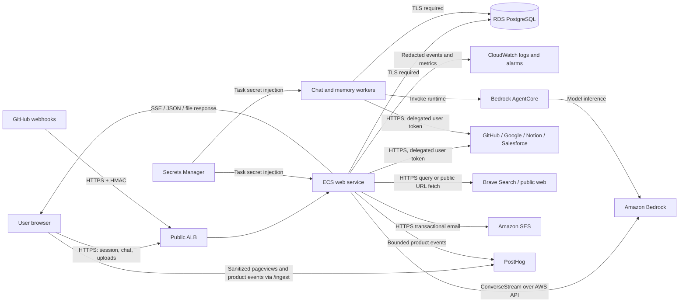

# Data Flow and Classification

This document inventories Comparative data for security review and DPA
discovery. It distinguishes the current pilot from planned controls. The
classification applies to the most sensitive value in a record or flow.

## Classification policy

| Class | Definition | Examples | Handling baseline |
|---|---|---|---|
| Public | Approved for public release | Product documentation, public app assets intentionally published by an owner | Integrity controls; no confidentiality requirement |
| Internal | Operational data whose disclosure is inconvenient but not a user-data breach | Service names, model IDs, aggregate latency, catalog metadata, deployment SHA | Authenticated access where practical; avoid public logs |
| Confidential | User, company, or provider content | Chat text, uploads, artifacts, memory, email/calendar/CRM records, feedback screenshots, tool inputs/results | Owner or explicit-share scope; TLS in transit; redaction in operational logs; approved retention |
| Restricted | Credentials or security material that can grant access | OAuth access/refresh tokens, session and encryption secrets, database credentials, invite/magic-link material | Never send to a model or log; Secrets Manager or application encryption; rotate/revoke on exposure |

Connected provider data and uploaded files are `Confidential` by default. If
they contain regulated data, customer secrets, export-controlled data, or
another higher-impact category, the originating organization's policy governs.
Comparative does not currently claim a regulated-data compliance boundary.

## Current data-flow map

### Trust boundaries

1. **Internet to ALB/web:** untrusted requests, uploads, OAuth callbacks,
   invite links, and signed webhooks cross into the application.
2. **Application to product store:** authenticated web and worker tasks read
   or write user-scoped product rows in Postgres.
3. **Application to model runtime:** selected context, messages, attachments,
   tool schemas, and tool results are sent to Bedrock or AgentCore.
4. **Application/runtime to providers:** delegated OAuth credentials authorize
   provider-specific reads or writes. Provider responses are untrusted data.
5. **Application to arbitrary public web:** the built-in fetch tool can request
   a public HTTP(S) host after scheme, DNS, redirect, and private-address
   checks. An admin denylist exists; there is no network allowlist.
6. **Operator to cross-owner data:** admins can inspect runs, threads, apps,
   and feedback for support. Cross-owner reads create `admin_data_access`
   receipts.
7. **CI/CD to production:** CodeBuild, ECR, CloudFormation/CDK, and ECS deploy
   commit-tagged images. Deploy receipts correlate source and task
   definitions. The ECR repositories are `MUTABLE` and the buildspecs also push
   a floating `latest`, so tag uniqueness is a deployment convention, not a
   registry guarantee; only the recorded `sha256:` digest is immutable. See
   [Rollback](../PRODUCTION_DEPLOYMENT.md#rollback) and #449.

## Store and flow inventory

| Data / flow | Class | Current location | In transit | At rest | Retention / deletion | Egress or processor |
|---|---|---|---|---|---|---|
| User identity, email, display name, role, preferences | Confidential | Postgres `users` | HTTPS; DB TLS required | RDS storage encryption is currently disabled | Persists with user; deprovision/purge pending #460 | Browser, SES for sign-in mail |
| JWT session cookie | Restricted | Browser cookie; signed by NextAuth | HTTPS | Browser cookie; no DB session row | Session lifetime / secret rotation | NextAuth application only |
| Magic-link verification token | Restricted | Hashed token in `verification_tokens` | HTTPS + SES | SHA-256 hash in Postgres; underlying RDS volume unencrypted | Single-use, 15-minute expiry; expired rows swept opportunistically | Amazon SES |
| Invitation token and recipient | Restricted token; Confidential email | Postgres `invitations` | HTTPS + SES | Plain random invite token in Postgres; underlying RDS volume unencrypted | Expiry/revoke/accept state; row retention pending #460 | Amazon SES |
| Chat threads and messages | Confidential | Postgres `chat_threads`, `chat_messages` | HTTPS/SSE; DB TLS; AWS API TLS | RDS storage encryption disabled | Until lifecycle action; approved window pending #460 | Bedrock/AgentCore; browser |
| Uploaded files and generated artifacts/apps | Confidential unless the content is separately approved for public release | Postgres `workspace_artifacts` and app tables | Base64 in HTTPS request; DB TLS; AWS API TLS | Content stored in Postgres; RDS storage encryption disabled | Version rows persist; hard-delete policy pending #460 | Bedrock/AgentCore; authorized browser viewers |
| Vault memory and capture queue | Confidential | Postgres `user_memory_items`, `memory_capture_queue` | DB TLS; AWS API TLS | RDS storage encryption disabled | User can review/archive; purge window pending #460 | Bedrock memory-capture turn; owner browser |
| Run inputs, outputs, events, and standard trace snapshots | Confidential | Postgres `runs`, `run_events`, related JSON | DB TLS; AWS API TLS | RDS storage encryption disabled; persisted traces are redacted and byte-bounded | Policy pending #460/#381 | Bedrock/AgentCore; owner/admin browser |
| Tool inputs, results, and receipts | Confidential | Postgres messages/runs/audit rows after redaction | Provider HTTPS; DB TLS | RDS storage encryption disabled | Audit/product windows pending #460 | Connected provider; Bedrock/AgentCore |
| OAuth access and refresh tokens | Restricted | Postgres `oauth_tokens` | Provider HTTPS; DB TLS | AES-256-GCM application ciphertext; RDS storage encryption disabled | **Indefinite. There is no disconnect route** — see #692 — and no automated rotation | Connected provider only; model never receives raw token |
| App/runtime secrets | Restricted | Secrets Manager JSON secret; injected into ECS tasks | AWS API/TLS | AWS-managed Secrets Manager key; no automatic rotation | Versioned by Secrets Manager; rotation runbook required | ECS task environment only |
| Feedback text, context, and screenshots | Confidential | Postgres `feedback_reports` | HTTPS; DB TLS | RDS storage encryption disabled | Admin triage state; policy pending #460 | Reporter and authorized admins |
| Audit ledger | Internal metadata plus redacted Confidential payloads | Postgres `audit_log` | DB TLS | RDS storage encryption disabled; append-only by application convention | Window pending #460; DB enforcement pending #457 | Authorized admins; no SIEM export yet |
| Application logs | Internal; may contain redacted Confidential metadata | CloudWatch log groups | AWS logging API/TLS | AWS-managed CloudWatch encryption | 30 days in CDK log groups | AWS CloudWatch; SNS receives alarm state, not transcripts |
| Product analytics | Confidential identity metadata plus Internal product metadata | PostHog Cloud | HTTPS through the first-party `/ingest` proxy or server SDK | PostHog-managed | PostHog project policy | Stable user ID and role, sanitized route template, event name, model ID, resource IDs, and bounded status/boolean properties; no chat, upload, artifact, feedback, or provider content |
| Model prompts and completions | Confidential | Transient Bedrock/AgentCore request/response path; durable source/answer remains in Postgres | AWS API/TLS | Governed by AWS service configuration and contract, not a Comparative product table | Confirm AWS service retention terms during enterprise review | AWS Bedrock/AgentCore; `us.*` profiles may route across US regions |
| Provider requests and responses | Confidential; tokens Restricted | GitHub, Google, Notion, Salesforce APIs | HTTPS | Provider-controlled | Provider policy plus Comparative product/audit copies | Named provider selected by user/tool gate |
| Search query and fetched public page | Internal or Confidential depending on query | Brave Search or requested public host; selected result may enter model context | HTTPS where target supports it; fetch also permits public HTTP | Remote-site controlled; redacted product copies may persist | Product copies follow chat/run policy | Brave Search; arbitrary public host passing SSRF and denylist checks |
| Deploy images and receipts | Internal | ECR, CloudFormation/ECS, CodeBuild logs | AWS API/TLS | AWS-managed service storage | Commit tags (mutable repositories, no lifecycle policy); service-specific log retention | AWS deployment services |

## External processors and egress

| Destination | Purpose | Data sent | Credential model | User control |
|---|---|---|---|---|
| AWS Bedrock / AgentCore | Model inference and durable agent execution | Prompt/context, selected attachments, tool schemas/results | ECS task IAM | User initiates chat/skill/schedule; admin controls model enablement |
| Amazon SES | Magic-link and invitation delivery | Recipient address and transactional content | Web task IAM scoped to verified identity | Admin invite or user sign-in request |
| GitHub | OAuth, source-control tools, webhook events | Scoped tool arguments; repository data returned | Per-user OAuth; webhook HMAC for inbound events | User connects and attests; **no in-product disconnect** (#692) |
| Google Gmail/Calendar | Mail/calendar read and user-authorized writes | Scoped query/draft/event data | Per-user OAuth; write authorization bound to the turn | User connects; write intent is explicit; **no in-product disconnect** (#692) |
| Notion | Page/database search and reads | Scoped tool arguments and returned workspace data | Per-user OAuth | User connects and attests; **no in-product disconnect** (#692) |
| Salesforce | Read-only CRM queries in the current tool surface | SOQL/search arguments and returned records | Per-user OAuth; instance URL validated | User connects and attests; **no in-product disconnect** (#692) |
| Brave Search | Public web search | Search query and result pagination | Server API key | Model invokes only when web capability is granted |
| Public web host | Read a user-requested public URL | URL, normal HTTP headers; response body enters bounded context | No credentials; credentialed URLs rejected | Admin denylist; private/link-local/metadata addresses blocked |
| PostHog Cloud | Product usage analytics | Stable user ID and role, sanitized route template, event name, model/resource IDs, and bounded status/boolean properties | Public project token; no provider or application credentials | Browser tracking disables autocapture, session replay, and exception capture; custom events contain no user content |

No provider connection grants access to another user's credentials. Shared
skills and apps are re-authorized using the executing/viewing user's own
identity and grants.

## Encryption and residency decisions

- Browser traffic terminates at the ALB over HTTPS; HTTP redirects to HTTPS.
  The ALB is internet-facing with no WAF in front of it (#691), and the
  application sends no security response headers — no CSP, HSTS, `nosniff`, or
  `frame-ancestors` outside the deployed-app sandbox routes (#693).
- The production database URL requires TLS. The current RDS storage volume is
  not encrypted (`StorageEncrypted: false`, verified 2026-07-25), so
  user-content-at-rest encryption is a release blocker for an enterprise data
  boundary. Tracked in #689; it needs a snapshot-copy-restore window, not a
  setting change.
- The instance is non-public. Postgres ingress is limited to the CDK-owned web,
  worker, and one-off deploy-task security groups. Because the instance
  predates the stack, `infra/scripts/reconcile-rds-perimeter.sh` enforces and
  rechecks that boundary on each production deployment; it fails closed on
  unrecognized port-5432 ingress. Full RDS adoption remains part of #492.
- OAuth tokens receive application-layer AES-256-GCM encryption before
  persistence. Other product content relies on the database storage layer,
  which is presently the gap above.
- Secrets Manager uses its AWS-managed key. A customer-managed key and
  automatic rotation are not configured.
- Bedrock model identifiers use `us.*` cross-region inference profiles.
  Comparative therefore asserts US-region routing, not single-region routing.
  Security/legal must either accept that boundary or require single-region
  model IDs before rollout.

## Retention and data-subject actions

Engineering must not invent policy values. [#460](https://github.com/DadJokez/AI-workspace/issues/460)
owns approved windows, hard deletion, legal hold, and deprovisioning. Until it
lands:

- product records generally persist until an existing user/admin lifecycle
  action removes or archives them;
- CloudWatch ECS log groups retain 30 days;
- OAuth tokens persist indefinitely — there is no disconnect route and no
  automated rotation (#692). A user who wants Comparative's access to their
  mailbox, calendar, repositories, or CRM withdrawn must revoke it at the
  provider, and the encrypted token row survives that;
- RDS automated backups retain one day in the pilot;
- a user deletion or legal-hold request requires a documented, reviewed
  operator procedure and privacy/legal approval. The manual procedure is
  written up in
  [`docs/runbooks/DSAR_RIGHT_TO_DELETE.md`](../runbooks/DSAR_RIGHT_TO_DELETE.md);
  it is deliberately explicit about which steps have no product support.

## Review checklist

- Confirm allowed data classes and prohibited data with the customer.
- Confirm US cross-region inference is inside the residency boundary.
- Approve subprocessors and provider-specific scopes.
- Approve retention, deletion, backup, and legal-hold values.
- Require encrypted/private RDS and private task networking before real
  enterprise data.
- Confirm log, trace, audit, and support-admin access are covered by access
  review and incident response.
